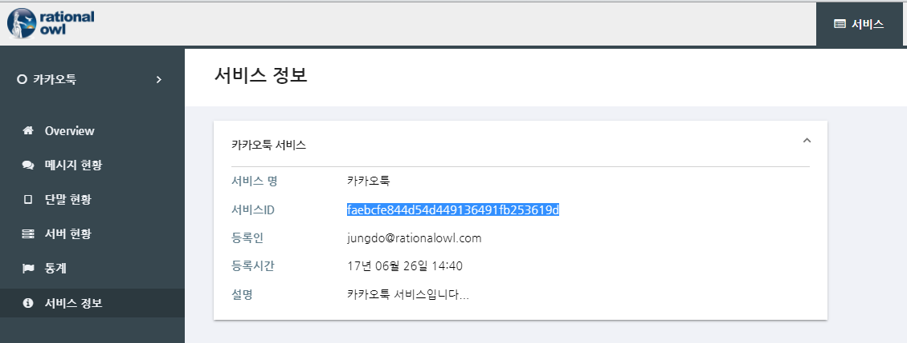
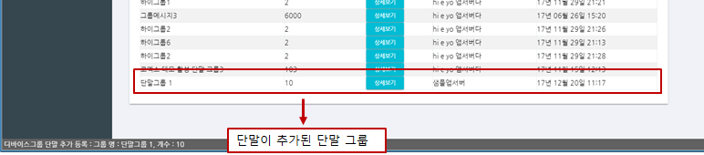
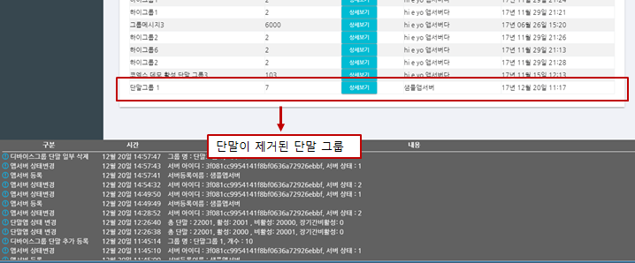
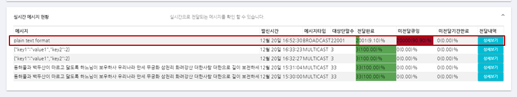

# 래셔널아울 C# 앱서버 샘플

C# 앱서버 샘플은 C# 앱서버 라이브러리에서 제공하는 API를 이용해서한 예제이다.

## 참고

.Net Core 2.0 프로젝트로 생성되었다.
Visual Studio Code로 작성되었다.
Newtonsoft.Json 라이브러리를 사용한다.
Windows 10에서 실행되었다.

## 샘플 프로젝트 설정

1. [라이브러리](http://guide.rationalowl.com/download/app-server/csharp/1.1.0/rationalowl.app.server.dll)를 다운받는다.
2. 프로젝트에 라이브러리를 등록한다.

예) csproj일 경우

```xml
<Reference Include="rationalowl.app.server">
    <SpecificVersion>False</SpecificVersion>
    <HintPath>.\lib\rationalowl.app.server.dll</HintPath>
</Reference>
```

래셔널아울 관리자콘솔이 제공하는 실시간 모니터링은 서비스 개발 전 단계에서 실시간 데이터의 전달 현황뿐 아니라 앱서버와 단말의 각 기능 별 성공 여부를 확인할 수 있어 개발속도를 향상시키고 서비스 운영단계에서는 예측 가능성과 서비스 대응력을 높이는 역할을 한다. 샘플 앱 서버 개발시 관리자콘솔을 이용해 각 기능별 동작을 확인함으로써 그 편의성을 확인할 수 있을 것이다.

>## 앱서버 등록/해제

## 앱서버 등록/해제 결과 콜백 등록

샘플 코드에서 setRegisterResultListener()를 검색하면 아래의 샘플 코드를 확인할 수 있다. 해당 API는 앱서버 초기화 루틴에 추가하여 앱서버 등록/해제 API 호출 후 결과 리스너를 지정한다. 

```c#
AppServerManager.getInstance().setRegisterResultListener(
new AppServerRegisterResultImpl());
AppServerManager.getInstance().setDeviceGroupListener(
    new DeviceGroupImpl());
AppServerManager.getInstance().setMsgListener(new MessageImpl());
```
1. setRegisterResultListener() API의 인자로 AppServerRegisterResultImpl 지정하였다.


## 앱서버 등록
샘플 코드에서 registerAppServer()를 검색하면 아래의 샘플 코드를 확인할 수 있다.

```c#
AppServerManager.getInstance().registerAppServer(
    Program.serviceId, "C# App Server Test", "gate.rationalowl.com", 9081);
```
1. registerAppServer() API의 첫째 인자인 serviceId는 등록하고자 하는 서비스의 서비스아이디이다. 서비스 아이디는 래셔널아울 콘솔의 '서비스 > 서비스 정보 > 서비스ID'에서 확인한다. 이를 카피하여 serviceId에 입력한다.



2. 두번째 인자인 appServerRegName에는 등록하고자 하는 앱서버의 등록 이름으로 래셔널아울 콘솔에서 앱서버를 구분하는 역할을 한다. 참고로 하나의 서비스 내에서 앱서버는 무료 평가판 기준 10개까지 등록이 가능하다. 본 문서에서 설명하는 샘플 서비스인 '카카오툭'에서는 현재 5대의 앱서버가 등록되어 있고 서비스 내 앱 서버 현황은 콘솔의 '서비스 > 서버 현황'에서 확인 가능하다. 앱서버 현황의 서버 정보 중 '서버등록이름'필드가 그것이다. 


3. 세번째 인자인 gateHost는 국가별 지역별로 자신의 서비스가 돌아가는 호스트와 가장 가까운 래셔널아울 메시징 서버의 컨택 포인트가 된다. 무료 평가판과 공용 클라우드 에디션의 경우 기본 'gate.rationalowl.com'을 입력하면 된다.

4. 네번째 인자인 gatePort는 게이트 서버의 포트로 9081을 입력한다.

5. 샘플앱서버를 실행하면 샘플 코드의 registerAppServer()을 호출하게 되고 그 결과 콜백인 SimpleRegisterResultListener 클래스의 onRegisterResult()이 호출된다. 샘플 콜백에서는 단지 등록 결과와 등록 결과 발급된 서버등록아이디를 결과창에 디스플레이한다.

```c#
class AppServerRegisterResultImpl : AppServerRegisterResultListener
{
    public override void onRegisterResult(int resultCode, string resultMsg,
                                string appServerRegId)
    {
        Console.WriteLine($"onRegisterResult {resultCode}, {resultMsg}, {appServerRegId}");
        Program.serverRegId = appServerRegId;
    }
    public override void onUnregisterResult(int resultCode, string resultMsg)
    {
        Console.WriteLine($"onUnregisterResult {resultCode}, {resultMsg}");
    }
};
```

> resultCode가 Result.RESULT_OK일 경우는 최초 등록시 새로 발급된 앱서버등록 아이디이고 
Result.RESULT_SERVER_REGNAME_ALREADY_REGISTERED 은 이미 등록된 경우로 앱서버를 재구동한 경우이고 이때의 appServerRegId(앱서버등록 아이디)를 확인해 보면 동일한 값임을 확인할 수 있다. 따라서 앱서버등록 이름은 저장/관리를 해야하고 앱서버 재구동시 registerAppServer() 호출시에 해당 값이 변경되어서는 안된다. 만약 다른 값을 입력하면 새로운 앱서버 등록 아이디가 발급되고 해당 앱서버는 서비스에 새로 추가되는 것으로 간주한다.

래셔널아울 관리자 콘솔은 앱서버 상태에 대해 실시간 모니터링을 제공한다. 앱서버 등록시 래셔널아울 관리자 콘솔의 '서비스 > 서버 현황'에서 실시간 확인 가능하다.


## 앱서버 등록 해제
샘플 코드에서 unregisterAppServer()를 검색하면 아래의 샘플 코드를 확인할 수 있다.

```c#
AppServerManager.getInstance().unregisterAppServer(Program.serviceId, Program.serverRegId);
```

1. unregisterAppServer() API의 첫째 인자인 serviceId는 서비스아이디이다. 
2. 두번째 인자인 serverRegId는 샘플 코드가 앞서 앱서버 등록 결과 발급받은 앱서버 등록 아이디이다. 
3. 샘플 코드에서 두 인자를 입력 후 샘플앱서버를 실행하면 샘플 코드의 unregServer()을 호출하게 되고 그 결과 콜백인 AppServerRegisterResultImpl 클래스의 onUnregisterResult()콜백이 호출된다. 샘플 콜백에서는 단지 등록 해제 결과를 결과창에 디스플레이한다. 앱서버가 등록 해제 되면 앱서버는 더이상 단말앱들과 실시간 메시지를 주고 받을 수 없고 래셔널아울 관리자 콘솔에서도 앱서버 정보가 사라진다.


>## 단말그룹 관리

관리자콘솔의 '서비스 > 단말 현황'에 등록된 단말 그룹의 현황을 확인 할 수 있다.


## 단말그룹 관리 결과 콜백 등록
샘플 코드에서 setDeviceGroupListener()를 검색하면 아래의 샘플 코드를 확인할 수 있다. 해당 API는 앱서버 초기화 루틴에 추가하여 단말그룹 관리 API 호출 후 결과 리스너를 지정한다. 

```c#
AppServerManager.getInstance().setRegisterResultListener(
new AppServerRegisterResultImpl());
AppServerManager.getInstance().setDeviceGroupListener(
    new DeviceGroupImpl());
AppServerManager.getInstance().setMsgListener(new MessageImpl());
```
1. setDeviceGroupListener() API의 인자로 DeviceGroupImpl 지정하였다.


## 단말그룹 생성

샘플 코드에서 createDeviceGroup()를 검색하면 아래의 샘플 코드를 확인할 수 있다.


```c#
AppServerManager.getInstance().createDeviceGroup("groupName",
"groupDesc", subDeviceList1);
```
1. createDeviceGroup() API의 첫째 인자인 groupName은 관리자 콘솔에서 '단말그룹명'으로 확인할 수 있도록  readable한 단말 그룹 구분자이다.
2. 두번째 인자인 groupDesc은 단말 그룹을 설명하는 내용이다. 입력하지 않을 시 null을 넣으면 된다.
3. devices는 단말 그룹 아이디 목록으로 단말 그룹 생성시 그룹에 포함할 단말 등록 아이디를 포함한다.
5. 샘플앱서버를 실행하면 createDeviceGroup()을 호출하게 되고 그 결과 콜백인 DeviceGroupImpl 클래스의 onDeviceGroupCreateResult()이 호출된다. 

```c#
class DeviceGroupImpl : DeviceGroupListener
{
    public override void onDeviceGroupCreateResult(int resultCode, string resultMsg,
                                            string deviceGrpId, string deviceGrpName,
                                            int deviceSize, string desc,
                                            string[] failedDevices,
                                            string requestId)
    {
        Console.WriteLine($"onDeviceGroupCreateResult {resultCode}, {resultMsg}, {deviceGrpId}, {deviceGrpName}, {deviceSize}, {desc}, {failedDevices}, {requestId}");
        Program.groupId = deviceGrpId;
    }
  ....
}
```

6. 관리자 콘솔의 '서비스 > 단말 현황'에서 단말 그룹을 보면 실시간으로 단말 그룹이 생성되는 것을 확인 할 수 있다.


## 단말그룹 내 단말 추가

샘플 코드에서 addDeviceGroup()를 검색하면 아래의 샘플 코드를 확인할 수 있다.


```c#
AppServerManager.getInstance().addDeviceGroup(groupId, subDeviceList2);
```
1. addDevicesToGroup() API의 첫째 인자인 groupId는 단말을 추가하고자 하는 대상 단말그룹의 아이디이다. 단말그룹 생성 예제의 onDeviceGroupCreateResult() 콜백 내에 인자로 넘어온 deviceGrpId의 값을 넣는다.
2. 두번째 인자인 devices는 단말 그룹에서 추가하고자 하는 단말들의 단말등록 아이디 목록이다.
3. 샘플앱서버를 실행하여 'add devices to group'버튼을 클릭하면 샘플 코드의 addDeviceGroup()을 호출하게 되고 그 결과 콜백인 SimpleDeviceGrpListener 클래스의 onDeviceGroupAddResult()이 호출된다. 

```c#
class DeviceGroupImpl : DeviceGroupListener
{
    public override void onDeviceGroupAddResult(int resultCode, string resultMsg,
                                string deviceGrpId, int totalDeviceSize,
                                int addedDeviceSize,
                                string[] failedDevices,
                                string requestId)
    {
        Console.WriteLine($"onDeviceGroupAddResult {resultCode}, {resultMsg}, {deviceGrpId}, {totalDeviceSize}, {addedDeviceSize}, {failedDevices}, {requestId}");
    }
  ...
}
```

4. 관리자 콘솔의 '서비스 > 단말 현황'에서 단말 그룹을 보면 단말 그룹내 단말 수가 5대에서 10대로 늘어난 것을 확인 할 수 있다.


## 단말그룹 내 단말 제거

샘플 코드에서 subtractDeviceGroup()를 검색하면 아래의 샘플 코드를 확인할 수 있다.


```c#
AppServerManager.getInstance().subtractDeviceGroup(groupId, subDeviceList2);
```
1. subtractDeviceGroup() API의 첫째 인자인 groupId는 단말을 제거하고자 하는 대상 단말그룹의 아이디이다. 단말그룹 생성 예제의 onDeviceGroupCreateResult() 콜백 내에 인자로 넘어온 deviceGrpId의 값을 넣는다.
2. 두번째 인자인 devices는 단말 그룹에서 제거하고자 하는 단말의 단말등록 아이디 목록이다.
3. 샘플앱서버를 실행하면 샘플 코드의 subtractDeviceGroup()을 호출하게 되고 그 결과 콜백인 DeviceGroupImpl 클래스의 onDeviceGroupSubtractResult()이 호출된다. 

```c#
class DeviceGroupImpl : DeviceGroupListener
{
    public override void onDeviceGroupSubtractResult(
        int resultCode, string resultMsg, string deviceGrpId, int totalDeviceSize,
        int subtractDeviceSize, string[] failedDevices, string requestId)
    {
        Console.WriteLine($"onDeviceGroupSubtractResult {resultCode}, {resultMsg}, {deviceGrpId}, {totalDeviceSize}, {subtractDeviceSize}, {failedDevices}, {requestId}");
    }
  ...
}
```

4. 관리자 콘솔의 '서비스 > 단말 현황'에서 단말 그룹을 보면 단말 그룹내 단말 수가 10대에서 7대로 줄어든 것을 확인 할 수 있다.



## 단말그룹 삭제

샘플 코드에서 deleteDeviceGroup()를 검색하면 아래의 샘플 코드를 확인할 수 있다.

```c#
AppServerManager.getInstance().deleteDeviceGroup(groupId);
```
1. deleteDeviceGroup() API의 첫째 인자인 groupId는 제거하고자 하는 대상 단말그룹의 아이디이다. 단말그룹 생성 예제의 onDeviceGroupCreateResult() 콜백 내에 인자로 넘어온 deviceGrpId의 값을 넣는다.
2. 샘플앱서버를 실행하면 샘플 코드의 deleteDeviceGroup()을 호출하게 되고 그 결과 콜백인 DeviceGroupImpl 클래스의 onDeviceGroupDeleteResult()이 호출된다. 

```c#
class DeviceGroupImpl : DeviceGroupListener
{
    public override void onDeviceGroupDeleteResult(int resultCode, string resultMsg,
                                            string deviceGrpId, string requestId)
    {
        Console.WriteLine($"onDeviceGroupDeleteResult {resultCode}, {resultMsg}, {deviceGrpId}, {requestId}");
    }
  ...
}
```

3. 관리자 콘솔의 '서비스 > 단말 현황'에서 샘플데모에서 생성한 '단말그룹1' 단말그룹이 삭제된 것을 확인할 수 있다.


>## 실시간 메시지 수/발신

관리자콘솔의 '서비스 > 메시지 현황'에서 실시간 메시지 전달 모니터링이 가능하다.


## 실시간 메시지 수/발신 결과 콜백 등록
샘플 코드에서 setMsgListener()를 검색하면 아래의 샘플 코드를 확인할 수 있다. 해당 API는 앱서버 초기화 루틴에 추가하여 메시지 수/발신시 호출되는 리스너를 지정한다. 

```c#
AppServerManager.getInstance().setRegisterResultListener(
new AppServerRegisterResultImpl());
AppServerManager.getInstance().setDeviceGroupListener(
    new DeviceGroupImpl());
AppServerManager.getInstance().setMsgListener(new MessageImpl());
```
1. setMsgListener() API의 인자로 MessageImpl 지정하였다.


## 멀티캐스트 발신

샘플 코드에서 sendMulticastMsg()를 검색하면 아래의 샘플 코드를 확인할 수 있다. 샘플코드에서는 3대의 단말에 JSON포맷의
데이터를 발신한다. 


```c#
AppServerManager.getInstance().sendMulticastMsg("멀티캐스트메시지",
                                                    subDeviceList1);
```
1. sendMulticastMsg() API의 첫째 인자인 jsonStr은 단말에 전달할 json포맷의 스트링 데이터이다.
2. 두번째 인자인 groutargetDevices는 데이터를 전달할 대상 단말의 단말 등록 아이디 목록이다.
3. 샘플앱서버를 실행하면 샘플 코드의 sendMulticastMsg()을 호출하게 되고 그 발신 결과는 콜백인 MessageImpl 클래스의 onSendMulticastMsgResult()이 호출된다. 해당 콜백은 메시지 발신이 성공했는지 여부를 확인하는 용도로 제공한다.

```c#
class MessageImpl : MessageListener
{
    public override void onSendMulticastMsgResult(int resultCode, string resultMsg,
                                        string requestId)
    {
        Console.WriteLine($"onSendMulticastMsgResult {resultCode}, {resultMsg}, {requestId}");
    }
  ...
}
```

4. 관리자 콘솔의 '서비스 > 메시지 현황'에서 실시간으로 메시지 전달현황을 확인 할 수 있다.


## 브로드캐스트 발신

샘플 코드에서 sendBroadcastMsg()를 검색하면 아래의 샘플 코드를 확인할 수 있다.


```c#
AppServerManager.getInstance().sendBroadcastMsg("브로드캐스트메시지");
```
1. sendBroadcastMsg() API의 첫째 인자인 data는 단순한 스트링 데이터이다.
2. 샘플앱서버를 실행하여 'send broadcast'버튼을 클릭하면 샘플 코드의 sendBroadcastMsg()을 호출하게 되고 그 발신 결과는 콜백인 MessageImpl 클래스의 onSendBroadcastMsgResult()이 호출된다. 해당 콜백은 메시지 발신이 성공했는지 여부를 확인하는 용도로 제공한다.

```c#
class MessageImpl : MessageListener
{
    public override void onSendBroadcastMsgResult(int resultCode, string resultMsg,
                                        string requestId)
    {
        Console.WriteLine($"onSendBroadcastMsgResult {resultCode}, {resultMsg}, {requestId}");
    }
  ...
}
```

3. 관리자 콘솔의 '서비스 > 메시지 현황'에서 실시간으로 메시지 전달현황을 확인 할 수 있다. 콘솔에서 전달 2001 단말, 미전달 단말이 20000단말이다. 



'서비스 > 단말 현황'에서 서비스에 등록된 모든 단말이 22,001대이고 그 중 활성상태(동접상태)가 2,001대로 메시지 전달률과 일치함을 알 수 있다. 참고로 다운스트림은 기본 3일간 큐잉을 지원하며 해당 기간 내에 단말앱이 활성상태가 되면 미전달 메시지를 바로 전달한다.


## 그룹메시지 발신


샘플 코드에서 sendGroupMsg()를 검색하면 아래의 샘플 코드를 확인할 수 있다. 


```c#
AppServerManager.getInstance().sendGroupMsg("그룹메시지", groupId);
```
1. sendMulticastMsg() API의 첫째 인자인 data는 단말에 전달할 스트링 데이터이다.
2. 두번째 인자인 deviceGroupId에는 데이터를 전달할 단말 그룹 아이디를 입력한다.
3. 샘플앱서버를 실행하면 샘플 코드의 sendGroupMsg()을 호출하게 되고 그 발신 결과는 콜백인 MessageImpl 클래스의 onSendGroupMsgResult()이 호출된다. 해당 콜백은 메시지 발신이 성공했는지 여부를 확인하는 용도로 제공한다.

```c#
class MessageImpl : MessageListener
{
    public override void onSendGroupMsgResult(int resultCode, string resultMsg,
                                    string requestId)
    {
        Console.WriteLine($"onSendGroupMsgResult {resultCode}, {resultMsg}, {requestId}");
    }
  ...
}
```

6. 관리자 콘솔의 '서비스 > 메시지 현황'에서 실시간으로 메시지 전달현황을 확인 할 수 있다. 


>## 업스트림 메시지 수신

샘플코드에서 onUpstreamMsgReceived를 검색하면 아래 코드를 확인할 수 있다. 

```c#
class MessageImpl : MessageListener
{
    public override void onUpstreamMsgReceived(string sender, long sendTime, string msg)
    {
        Console.WriteLine($"onUpstreamMsgReceived {sender}, {sendTime}, {msg}");
    }
  ...
}
```
앱서버가 업스트림 메시지를 수신하면 onUpstreamMsgReceived() 콜백이 호출된다.