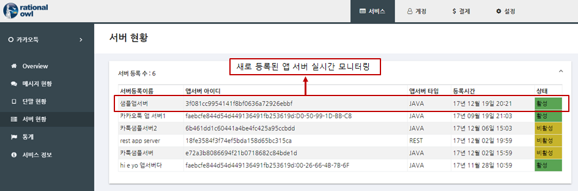

# 래셔널아울 JAVA 앱서버 샘플
JAVA 앱서버 샘플은 JAVA 앱서버 라이브러리에서 제공하는 API를 이용해서 앱서버를 만드는 것을 쉽게 따라할 수 있도록 쉽게 작성되었다.
각 버튼은 앱서버 API와 1대1 매핑이 되어 API 호출 결과는 가운데 output 창에 디스플레이된다.


## 샘플 프로젝트 설정
1. githup에서 샘플 코드를 다운받는다.
2. 이클립스에서 다운받은 폴더를 import 하면 샘플 앱 서버 환경이 만들어진다.
    - File > import > General > Existing Projects into Workspace
    - 이클립스 이외의 JAVA 툴에서도 다운받은 소스와 라이브러리로 쉽게 프로젝트 환경을 구성할 수 있다.


래셔널아울 관리자콘솔이 제공하는 실시간 모니터링은 서비스 개발 전 단계에서 실시간 데이터의 전달 현황뿐 아니라 앱서버와 단말의 각 기능 별 성공 여부를 확인할 수 있어 개발속도를 향상시키고 서비스 운영단계에서는 예측 가능성과 서비스 대응력을 높이는 역할을 한다. 샘플 앱 서버 개발시 관리자콘솔을 이용해 각 기능별 동작을 확인함으로써 그 편의성을 확인할 수 있을 것이다.


>## 앱서버 등록 
샘플 코드에서 registerAppServer()를 검색하면 아래의 샘플 코드를 확인할 수 있다.

```java
private void regServer() {
    AppServerManager serverMgr = AppServerManager.getInstance();
    // edit service id as yours
    String serviceId = "service ID 1";
    String appServerRegName = "app server registraion name1";
    String gateHost = "gate.rationalowl.com";
    int gatePort = 9081;   
    serverMgr.registerAppServer(serviceId, appServerRegName, gateHost, gatePort);
    output("Register request");
}
```
1. registerAppServer() API의 첫째 인자인 serviceId는 등록하고자 하는 서비스의 서비스아이디이다. 서비스 아이디는 래셔널아울 콘솔의 '서비스 > 서비스 정보 > 서비스ID'에서 확인한다. 이를 카피하여 serviceId에 입력한다.


2. 두번째 인자인 appServerRegName에는 등록하고자 하는 앱서버의 등록 이름으로 래셔널아울 콘솔에서 앱서버를 구분하는 역할을 한다. 참고로 하나의 서비스 내에서 앱서버는 무료 평가판 기준 10개까지 등록이 가능하다. 본 문서에서 설명하는 샘플 서비스인 '카카오툭'에서는 현재 5대의 앱서버가 등록되어 있고 서비스 내 앱 서버 현황은 콘솔의 '서비스 > 서버 현황'에서 확인 가능하다. 앱서버 현황의 서버 정보 중 '서버등록이름'필드가 그것이다. 


3. 세번째 인자인 gateHost는 국가별 지역별로 자신의 서비스가 돌아가는 호스트와 가장 가까운 래셔널아울 메시징 서버의 컨택 포인트가 된다. 무료 평가판과 공용 클라우드 에디션의 경우 기본 'gate.rationalowl.com'을 입력하면 된다.

4. 네번째 인자인 gatePort는 게이트 서버의 포트로 9081을 입력한다.

5. 샘플앱서버를 실행하여 'register'버튼을 클릭하면 샘플 코드의 registerAppServer()을 호출하게 되고 그 결과 콜백인 SimpleRegisterResultListener 클래스의 onRegisterResult()이 호출된다. 샘플 콜백에서는 단지 등록 결과와 등록 결과 발급된 서버등록아이디를 결과창에 디스플레이한다.

```java
class SimpleRegisterResultListener implements AppServerRegisterResultListener {

    public void onRegisterResult(int resultCode, String resultMsg, String appServerRegId, String appServerRegName) {
        output("RegisterResult:" + resultMsg + "  reg server id = " + appServerRegId + " reg server name = " + appServerRegName);

        if (resultCode == Result.RESULT_OK || resultCode == Result.RESULT_SERVER_REGNAME_ALREADY_REGISTERED) {
            // should save and manage mServerRegName and mServerRegId to the file or db.
        }
    }


    public void onUnregisterResult(int resultCode, String resultMsg) {
        output("UnregisterResult:" + resultMsg);
    }
}
```
아래는 해당 콜백에 의한 실제 샘플 앱서버 실행 화면이다.


> resultCode가 Result.RESULT_OK일 경우는 최초 등록시 새로 발급된 앱서버등록 아이디이고 
Result.RESULT_SERVER_REGNAME_ALREADY_REGISTERED 은 이미 등록된 경우로 앱서버를 재구동한 경우이고 이때의 appServerRegId(앱서버등록 아이디)를 확인해 보면 동일한 값임을 확인할 수 있다. 따라서 앱서버등록 이름은 저장/관리를 해야하고 앱서버 재구동시 registerAppServer() 호출시에 해당 값이 변경되어서는 안된다. 만약 다른 값을 입력하면 새로운 앱서버 등록 아이디가 발급되고 해당 앱서버는 서비스에 새로 추가되는 것으로 간주한다.

래셔널아울 관리자 콘솔은 앱서버 상태에 대해 실시간 모니터링을 제공한다. 앱서버 등록시 래셔널아울 관리자 콘솔의 '서비스 > 서버 현황'에서 실시간 확인 가능하다.



## 앱서버 등록 해제
샘플 코드에서 unregisterAppServer()를 검색하면 아래의 샘플 코드를 확인할 수 있다.

```java
private void unregServer() {
    AppServerManager serverMgr = AppServerManager.getInstance();
    String serviceId = "faebcfe844d54d449136491fb253619d";
    String serverRegId = "b0a4207baec4420ead6044295f13f3fe";
    //String serverRegId = "your app server registration Id";
    serverMgr.unregisterAppServer(serviceId, serverRegId);
    output("unregServer request");
}
```
1. unregisterAppServer() API의 첫째 인자인 serviceId는 서비스아이디이다. 
2. 두번째 인자인 serverRegId는 샘플 코드가 앞서 앱서버 등록 결과 발급받은 앱서버 등록 아이디이다. 
3. 샘플 코드에서 두 인자를 입력 후 샘플앱서버를 실행하여 'un-register'버튼을 클릭하면 샘플 코드의 unregServer()을 호출하게 되고 그 결과 콜백인 SimpleRegisterResultListener 클래스의 onUnregisterResult()콜백이 호출된다. 샘플 콜백에서는 단지 등록 해제 결과를 결과창에 디스플레이한다. 앱서버가 등록 해제 되면 앱서버는 더이상 단말앱들과 실시간 메시지를 주고 받을 수 없고 래셔널아울 관리자 콘솔에서도 앱서버 정보가 사라진다.


>## 단말그룹 관리

관리자콘솔의 '서비스 > 단말 현황'에 등록된 단말 그룹의 현황을 확인 할 수 있다.


## 단말그룹 생성

샘플 코드에서 createDeviceGroup()를 검색하면 아래의 샘플 코드를 확인할 수 있다.


```java
private void createDeviceGroup() {
    AppServerManager serverMgr = AppServerManager.getInstance();
    // device group name which will be displayed in the console
    String groupName = "단말그룹 1";
    // device group description
    String groupDesc = "단말그룹 1입니다.";
    // devices which should be grouped.
    // maximum devices.size() should be below 2,000 in the
    // createDeviceGroup() API.
    ArrayList<String> devices = new ArrayList<String>();
    // edit device registration id as yours        
    devices.add("be64c16df4e44e84a1bfb85624133a7e");
    devices.add("09876d41ac964d1295b28fcaa3f08744");
    devices.add("5e4520bb31284957987c97b4eae01b0f");
    devices.add("f38a2e95f94c4dea90c797edb19dcd34");
    devices.add("dc9f257af2454ee089419b42bdd8b902");
    String requestId = serverMgr.createDeviceGroup(groupName, groupDesc, devices);
    output("createDeviceGroup requestId = " + requestId);
}
```
1. createDeviceGroup() API의 첫째 인자인 groupName은 관리자 콘솔에서 '단말그룹명'으로 확인할 수 있도록  readable한 단말 그룹 구분자이다.
2. 두번째 인자인 groupDesc은 단말 그룹을 설명하는 내용이다. 입력하지 않을 시 null을 넣으면 된다.
3. devices는 단말 그룹 아이디 목록으로 단말 그룹 생성시 그룹에 포함할 단말 등록 아이디를 포함한다.
5. 샘플앱서버를 실행하여 'create device group'버튼을 클릭하면 샘플 코드의 createDeviceGroup()을 호출하게 되고 그 결과 콜백인 SimpleDeviceGrpListener 클래스의 onDeviceGroupCreateResult()이 호출된다. 

```java
class SimpleDeviceGrpListener implements DeviceGroupListener {

    public void onDeviceGroupCreateResult(int resultCode, String resultMsg, String deviceGrpId, String deviceGrpName, int deviceSize, String desc, ArrayList<String> failedDevices, String requestId) {
        output("onSendMulticastMsgResult: resultCode = " + resultCode + "resultMsg = " + resultMsg + " requestId="+ requestId);

        if (resultCode == Result.RESULT_OK) {
            // should save and manage deviceGrpId
        }
    }
}
```
샘플 콜백에서는 단지 결과를 결과창에 표시한다. 
> 샘플 코드를 재실행시마다 register버튼을 눌러 먼저 앱서버 라이브러리를 구동시킨다.


6. 관리자 콘솔의 '서비스 > 단말 현황'에서 단말 그룹을 보면 실시간으로 단말 그룹이 생성되는 것을 확인 할 수 있다.


## 단말그룹 내 단말 추가

샘플 코드에서 addDeviceGroup()를 검색하면 아래의 샘플 코드를 확인할 수 있다.


```java
private void addDevicesToGroup() {
    AppServerManager serverMgr = AppServerManager.getInstance();
    // group id which is generated by onDeviceGroupCreateResult() callback.
    String groupId = "a22b830c17af452a84e0b93a4ac2815f";

    // devices which should be added to the device group
    // maximum devices.size() should be below 2,000 in the addDeviceGroup() API.
    ArrayList<String> devices = new ArrayList<String>();
    devices.add("27af1a1cb5454b1caf5ccfd95d2c5b6f");
    devices.add("3b04be2c545d491d8323539bcc1a0176");
    devices.add("7661ad50f28842658e0bcbb5549a15fd");
    devices.add("bafb976f957a499c9d82025455fd34f9");
    devices.add("f63e97e3344f4e4b860308fe0756e236");
    String requestId = serverMgr.addDeviceGroup(groupId, devices);
    output("addDevicesToGroup request requestId = " + requestId);
}
```
1. addDevicesToGroup() API의 첫째 인자인 groupId는 단말을 추가하고자 하는 대상 단말그룹의 아이디이다. 단말그룹 생성 예제의 onDeviceGroupCreateResult() 콜백 내에 인자로 넘어온 deviceGrpId의 값을 넣는다.
2. 두번째 인자인 devices는 단말 그룹에서 추가하고자 하는 단말들의 단말등록 아이디 목록이다.
3. 샘플앱서버를 실행하여 'add devices to group'버튼을 클릭하면 샘플 코드의 addDeviceGroup()을 호출하게 되고 그 결과 콜백인 SimpleDeviceGrpListener 클래스의 onDeviceGroupAddResult()이 호출된다. 

```java
class SimpleDeviceGrpListener implements DeviceGroupListener {    

    public void onDeviceGroupAddResult(int resultCode, String resultMsg, String deviceGrpId, int totalDeviceSize, int addedDeviceSize, ArrayList<String> failedDevices, String requestId) {
        output("onSendMulticastMsgResult: resultCode = " + resultCode + "resultMsg = " + resultMsg + " requestId="+ requestId);
    }
}
```
샘플 콜백에서는 단지 결과를 결과창에 표시한다. 
> 샘플 앱서버를 재실행시마다 register버튼을 눌러 먼저 앱서버 라이브러리를 구동시킨다.


4. 관리자 콘솔의 '서비스 > 단말 현황'에서 단말 그룹을 보면 단말 그룹내 단말 수가 5대에서 10대로 늘어난 것을 확인 할 수 있다.


## 단말그룹 내 단말 제거

샘플 코드에서 subtractDeviceGroup()를 검색하면 아래의 샘플 코드를 확인할 수 있다.


```java
private void subtractDevicesFromGroup() {
    AppServerManager serverMgr = AppServerManager.getInstance();
    // group id which is generated by onDeviceGroupCreateResult() callback.
    String groupId = "faebcfe844d54d449136491fb253619d";

    // devices which should be removed from the device group
    // maximum devices.size() should be below 2,000 in the subtractDeviceGroup() API.
    ArrayList<String> devices = new ArrayList<String>();
    devices.add("27af1a1cb5454b1caf5ccfd95d2c5b6f");
    devices.add("3b04be2c545d491d8323539bcc1a0176");
    devices.add("7661ad50f28842658e0bcbb5549a15fd");
    String requestId = serverMgr.subtractDeviceGroup(groupId, devices);
    output("subtractDevicesFromGroup requestId = " + requestId);
}
```
1. subtractDeviceGroup() API의 첫째 인자인 groupId는 단말을 제거하고자 하는 대상 단말그룹의 아이디이다. 단말그룹 생성 예제의 onDeviceGroupCreateResult() 콜백 내에 인자로 넘어온 deviceGrpId의 값을 넣는다.
2. 두번째 인자인 devices는 단말 그룹에서 제거하고자 하는 단말의 단말등록 아이디 목록이다.
3. 샘플앱서버를 실행하여 'remove devices from group'버튼을 클릭하면 샘플 코드의 subtractDeviceGroup()을 호출하게 되고 그 결과 콜백인 SimpleDeviceGrpListener 클래스의 onDeviceGroupSubtractResult()이 호출된다. 

```java
class SimpleDeviceGrpListener implements DeviceGroupListener {

    public void onDeviceGroupSubtractResult(int resultCode, String resultMsg, String deviceGrpId, int totalDeviceSize, int subtractDeviceSize, ArrayList<String> failedDevices, String requestId) {
        output("onDeviceGroupSubtractResult: resultCode = " + resultCode + "resultMsg = " + resultMsg + " requestId="+ requestId);
    }
}
```
샘플 콜백에서는 단지 결과를 결과창에 표시한다. 
> 샘플 앱서버를 재실행시마다 register버튼을 눌러 먼저 앱서버 라이브러리를 구동시킨다.


4. 관리자 콘솔의 '서비스 > 단말 현황'에서 단말 그룹을 보면 단말 그룹내 단말 수가 10대에서 7대로 줄어든 것을 확인 할 수 있다.


## 단말그룹 삭제

샘플 코드에서 deleteDeviceGroup()를 검색하면 아래의 샘플 코드를 확인할 수 있다.

```java
private void deleteGroup() {
    AppServerManager serverMgr = AppServerManager.getInstance();
    // group id which is generated by onDeviceGroupCreateResult() callback.
    String groupId = "a22b830c17af452a84e0b93a4ac2815f";
    String requestId = serverMgr.deleteDeviceGroup(groupId);
    output("deleteGroup requestId = " + requestId);
}
```
1. deleteDeviceGroup() API의 첫째 인자인 groupId는 제거하고자 하는 대상 단말그룹의 아이디이다. 단말그룹 생성 예제의 onDeviceGroupCreateResult() 콜백 내에 인자로 넘어온 deviceGrpId의 값을 넣는다.
2. 샘플앱서버를 실행하여 'delete device group'버튼을 클릭하면 샘플 코드의 deleteDeviceGroup()을 호출하게 되고 그 결과 콜백인 SimpleDeviceGrpListener 클래스의 onDeviceGroupDeleteResult()이 호출된다. 

```java
class SimpleDeviceGrpListener implements DeviceGroupListener {

    public void onDeviceGroupDeleteResult(int resultCode, String resultMsg, String deviceGrpId, String requestId) {
        output("onDeviceGroupDeleteResult: resultCode = " + resultCode + "resultMsg = " + resultMsg + " requestId="+ requestId);
    }
}
```
샘플 콜백에서는 단지 결과를 결과창에 표시한다. 
> 샘플 앱서버를 재실행시마다 register버튼을 눌러 먼저 앱서버 라이브러리를 구동시킨다.


3. 관리자 콘솔의 '서비스 > 단말 현황'에서 샘플데모에서 생성한 '단말그룹1' 단말그룹이 삭제된 것을 확인할 수 있다.


>## 다운스트림 메시지 발신

관리자콘솔의 '서비스 > 메시지 현황'에서 실시간 메시지 전달 모니터링이 가능하다.


## 멀티캐스트 발신

샘플 코드에서 sendMulticastMsg()를 검색하면 아래의 샘플 코드를 확인할 수 있다. 샘플코드에서는 3대의 단말에 JSON포맷의
데이터를 발신한다. 


```java
private void sendMulticastMsg() {        
    // data format is json string 
    // and jackson json library has used.
    ObjectMapper mapper = new ObjectMapper();
    Map<String, Object> jsonData = new LinkedHashMap<String, Object>();
    jsonData.put("key1", "value1");
    jsonData.put("key2", 2);        
    String jsonStr = null;
    try {
        jsonStr = mapper.writeValueAsString(jsonData);
        // target device registration id
        ArrayList<String> targetDevices = new ArrayList<String>();
        targetDevices.add("27af1a1cb5454b1caf5ccfd95d2c5b6f");
        targetDevices.add("3b04be2c545d491d8323539bcc1a0176");
        targetDevices.add("7661ad50f28842658e0bcbb5549a15fd");
        AppServerManager serverMgr = AppServerManager.getInstance();
        String requestId = serverMgr.sendMulticastMsg(jsonStr, targetDevices);
        output("sendMulticastMsg Msg :" + jsonStr + "requestId = " + requestId);
    }
    catch (JsonProcessingException e) {           
        e.printStackTrace();
    }        
}
```
1. sendMulticastMsg() API의 첫째 인자인 jsonStr은 단말에 전달할 json포맷의 스트링 데이터이다.
2. 두번째 인자인 groutargetDevices는 데이터를 전달할 대상 단말의 단말 등록 아이디 목록이다.
3. 샘플앱서버를 실행하여 'send multicast'버튼을 클릭하면 샘플 코드의 sendMulticastMsg()을 호출하게 되고 그 발신 결과는 콜백인 SimpleMessageListener 클래스의 onSendMulticastMsgResult()이 호출된다. 해당 콜백은 메시지 발신이 성공했는지 여부를 확인하는 용도로 제공한다.

```java
class SimpleMessageListener implements MessageListener {
    @Override
    public void onSendMulticastMsgResult(int resultCode, String resultMsg, String requestId) {
        output("onSendMulticastMsgResult: resultCode = " + resultCode + "resultMsg = " + resultMsg + " requestId="+ requestId);
    }
}
```
샘플 콜백에서는 단지 메시지 발신 결과를 결과창에 표시한다. 
> 샘플 코드를 재실행시마다 register버튼을 눌러 먼저 앱서버 라이브러리를 구동시킨다.


6. 관리자 콘솔의 '서비스 > 메시지 현황'에서 실시간으로 메시지 전달현황을 확인 할 수 있다.


## 브로드캐스트 발신

샘플 코드에서 sendBroadcastMsg()를 검색하면 아래의 샘플 코드를 확인할 수 있다.


```java
private void sendBroadcastMsg() {
    String data = "broadcast message!!";
    AppServerManager serverMgr = AppServerManager.getInstance();
    String requestId = serverMgr.sendBroadcastMsg(data);
    output("sendBroadcastMsg Msg :" + data + "requestId = " + requestId);
}
```
1. sendBroadcastMsg() API의 첫째 인자인 data는 단순한 스트링 데이터이다.
3. 샘플앱서버를 실행하여 'send broadcast'버튼을 클릭하면 샘플 코드의 sendBroadcastMsg()을 호출하게 되고 그 발신 결과는 콜백인 SimpleMessageListener 클래스의 onSendBroadcastMsgResult()이 호출된다. 해당 콜백은 메시지 발신이 성공했는지 여부를 확인하는 용도로 제공한다.

```java
class SimpleMessageListener implements MessageListener {
    @Override
    public void onSendBroadcastMsgResult(int resultCode, String resultMsg, String requestId) {
        output("onSendBroadcastMsgResult: resultCode = " + resultCode + "resultMsg = " + resultMsg + " requestId="+ requestId);
    }
}
```
샘플 콜백에서는 단지 메시지 발신 결과를 결과창에 표시한다. 
> 샘플 코드를 재실행시마다 register버튼을 눌러 먼저 앱서버 라이브러리를 구동시킨다.


6. 관리자 콘솔의 '서비스 > 메시지 현황'에서 실시간으로 메시지 전달현황을 확인 할 수 있다.


## 멀티캐스트 발신

샘플 코드에서 sendMulticastMsg()를 검색하면 아래의 샘플 코드를 확인할 수 있다. 샘플코드에서는 3대의 단말에 JSON포맷의
데이터를 발신한다. 


```java
private void sendMulticastMsg() {        
    // data format is json string 
    // and jackson json library has used.
    ObjectMapper mapper = new ObjectMapper();
    Map<String, Object> jsonData = new LinkedHashMap<String, Object>();
    jsonData.put("key1", "value1");
    jsonData.put("key2", 2);        
    String jsonStr = null;
    try {
        jsonStr = mapper.writeValueAsString(jsonData);
        // target device registration id
        ArrayList<String> targetDevices = new ArrayList<String>();
        targetDevices.add("27af1a1cb5454b1caf5ccfd95d2c5b6f");
        targetDevices.add("3b04be2c545d491d8323539bcc1a0176");
        targetDevices.add("7661ad50f28842658e0bcbb5549a15fd");
        AppServerManager serverMgr = AppServerManager.getInstance();
        String requestId = serverMgr.sendMulticastMsg(jsonStr, targetDevices);
        output("sendMulticastMsg Msg :" + jsonStr + "requestId = " + requestId);
    }
    catch (JsonProcessingException e) {           
        e.printStackTrace();
    }        
}
```
1. sendMulticastMsg() API의 첫째 인자인 jsonStr은 단말에 전달할 json포맷의 스트링 데이터이다.
2. 두번째 인자인 groutargetDevices는 데이터를 전달할 대상 단말의 단말 등록 아이디 목록이다.
3. 샘플앱서버를 실행하여 'send multicast'버튼을 클릭하면 샘플 코드의 sendMulticastMsg()을 호출하게 되고 그 발신 결과는 콜백인 SimpleMessageListener 클래스의 onSendMulticastMsgResult()이 호출된다. 해당 콜백은 메시지 발신이 성공했는지 여부를 확인하는 용도로 제공한다.

```java
class SimpleMessageListener implements MessageListener {
    @Override
    public void onSendGroupMsgResult(int resultCode, String resultMsg, String requestId) {
        output("onSendGroupMsgResult: resultCode = " + resultCode + "resultMsg = " + resultMsg + " requestId="+ requestId);
    }
}
```
샘플 콜백에서는 단지 메시지 발신 결과를 결과창에 표시한다. 
> 샘플 코드를 재실행시마다 register버튼을 눌러 먼저 앱서버 라이브러리를 구동시킨다.


6. 관리자 콘솔의 '서비스 > 메시지 현황'에서 실시간으로 메시지 전달현황을 확인 할 수 있다. 콘솔에서 전달 2001 단말, 미전달 단말이 20000단말이다. 


'서비스 > 단말 현황'에서 서비스에 등록된 모든 단말이 22,001대이고 그 중 활성상태(동접상태)가 2,001대로 메시지 전달률과 일치함을 알 수 있다. 참고로 다운스트림은 API는 기본 3일간 큐잉을 지원하며 해당 기간내에 단말앱이 활성상태가 되면 미전달 메시지를 바로 전달한다.


>## 업스트림 메시지 수신

샘플코드에서 onUpstreamMsgReceived를 검색하면 아래 코드를 확인할 수 있다. 

```java
class SimpleMessageListener implements MessageListener {

    @Override
    public void onUpstreamMsgReceived(String sender, long sendTime, String msg) {
        output("onUpstreamMsgReceived sender device reg id : " + sender + "send time:" + sendTime + " msg : " + msg);
    }
}
```

단말앱에서 앱서버로 업스트림 메시지를 발신하면 앱서버의 onUpstreamMsgReceived() 콜백이 호출된다. 단말앱에서 upstream 메시지를 발신하면 해당 콜백이 호출되는 것을 확인할 수 있을 것이다.