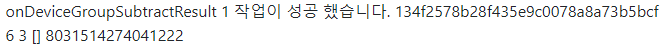

# 래셔널아울 Python 앱서버 샘플

Python 앱서버 샘플은 Python 앱서버 라이브러리에서 제공하는 API를 이용해서 Django 위에서 앱서버를 만드는 것을 쉽게 따라할 수 있도록 작성되었다.

## 참고

본 샘플은 Django와 channels를 이용한 WebSocket으로 구현되었다.

앱서버의 자세한 설명은 [가이드](http://guide.rationalowl.com/guide/app-server)에서 확인할 수 있다.

API 명세는 [API Reference](http://guide.rationalowl.com/api-doc/app-server/python/)에서 확인할 수 있다.

## 샘플 프로젝트 설정

1. 레셔널아울 Python 서버 라이브러리를 받아 설치한다.(자세한 설치 방법은 [라이브러리 설치](http://guide.rationalowl.com/guide/app-server#%EC%95%B1-%EC%84%9C%EB%B2%84-%EB%9D%BC%EC%9D%B4%EB%B8%8C%EB%9F%AC%EB%A6%AC-%EC%A0%81%EC%9A%A9) 참조)
2. 의존 모듈을 설치한다
```sh
pip install channels daphne
```

3. 실행
```sh
python manage.py runserver
```
4. 브라우저에서 http://localhost:8000 로 접속한다

래셔널아울 관리자콘솔이 제공하는 실시간 모니터링은 서비스 개발 전 단계에서 실시간 데이터의 전달 현황뿐 아니라 앱서버와 단말의 각 기능 별 성공 여부를 확인할 수 있어 개발속도를 향상시키고 서비스 운영단계에서는 예측 가능성과 서비스 대응력을 높이는 역할을 한다. 샘플 앱 서버 개발시 관리자콘솔을 이용해 각 기능별 동작을 확인함으로써 그 편의성을 확인할 수 있을 것이다.

>## 앱서버 등록

앱서버 등록은 rationalowl/consumers.py 에서 구현했다.
앱서버 등록 및 리스너들을 등록해주었다.

```python
AppServerManager().setRegisterResultListener(AppServerRegisterResultListenerImpl())
AppServerManager().setMsgListener(MessageListenerImpl())
AppServerManager().setDeviceGroupListener(DeviceGroupListenerImpl())

req_id = AppServerManager().registerAppServer(
    'ab03d23035e74e2fbd868a6f243c2dd5', 'sample-app-server-python', 'gate.rationalowl.com', 9081)
```

### 리스너

리스너에 응답이 오면 channels의 Group에 메시지를 전달하도록 구현했다.

```python
from channels import Group

class AppServerRegisterResultListenerImpl(AppServerRegisterResultListener):
    def onRegisterResult(self, resultCode, resultMsg, appServerRegId):
        msg = 'onRegisterResult {} {} {}'.format(resultCode, resultMsg, appServerRegId)
        Group('rational').send({'text': msg})

    def onUnregisterResult(self, resultCode, resultMsg):
        msg = 'onUnregisterResult {} {}'.format(
            resultCode, resultMsg)
        Group('rational').send({'text': msg})

class DeviceGroupListenerImpl(DeviceGroupListener):
    def onDeviceGroupCreateResult(self, resultCode,  resultMsg,  deviceGrpId,
                                    deviceGrpName,  deviceSize,  desc, failedDevices,  requestId):
        msg = 'onDeviceGroupCreateResult {} {} {} {} {} {} {} {}'.format(
            resultCode, resultMsg, deviceGrpId, deviceGrpName,  deviceSize,  desc, failedDevices,  requestId)
        Group('rational').send({'text': msg})

    def onDeviceGroupAddResult(self, resultCode,  resultMsg,  deviceGrpId,
                                totalDeviceSize,  addedDeviceSize, failedDevices,  requestId):
        msg = 'onDeviceGroupAddResult {} {} {} {} {} {} {}'.format(
            resultCode, resultMsg, deviceGrpId, totalDeviceSize,  addedDeviceSize, failedDevices,  requestId)
        Group('rational').send({'text': msg})

    def onDeviceGroupSubtractResult(self, resultCode,  resultMsg,  deviceGrpId,
                                    totalDeviceSize,  subtractDeviceSize, failedDevices,  requestId):
        msg = 'onDeviceGroupSubtractResult {} {} {} {} {} {} {}'.format(
            resultCode, resultMsg, deviceGrpId, totalDeviceSize,  subtractDeviceSize, failedDevices,  requestId)
        Group('rational').send({'text': msg})

    def onDeviceGroupDeleteResult(self, resultCode,  resultMsg,  deviceGrpId, requestId):
        msg = 'onDeviceGroupDeleteResult {} {} {} {}'.format(
            resultCode, resultMsg, deviceGrpId,  requestId)
        Group('rational').send({'text': msg})


class MessageListenerImpl(MessageListener):
    def onUpstreamMsgReceived(self, sender, sendTime, msg):
        msg = 'onUpstreamMsgReceived {} {} {}'.format(
            sender, sendTime, msg)
        Group('rational').send({'text': msg})


    def onSendUnicastMsgResult(self, resultCode, resultMsg, requestId):
        msg = 'onSendUnicastMsgResult {} {} {}'.format(
            resultCode, resultMsg, requestId)
        Group('rational').send({'text': msg})

    def onSendMulticastMsgResult(self, resultCode, resultMsg, requestId):
        msg = 'onSendMulticastMsgResult {} {} {}'.format(
                    resultCode, resultMsg, requestId)
        Group('rational').send({'text': msg})

    def onSendBroadcastMsgResult(self, resultCode, resultMsg, requestId):
        msg = 'onSendBroadcastMsgResult {} {} {}'.format(
            resultCode, resultMsg, requestId)
        Group('rational').send({'text': msg})

    def onSendGroupMsgResult(self, resultCode, resultMsg, requestId):
        msg = 'onSendGroupMsgResult {} {} {}'.format(
            resultCode, resultMsg, requestId)
        Group('rational').send({'text': msg})
```


### 웹소켓 핸들러

웹소켓 연결, 메시지 받음, 연결 해제에 대한 핸들러를 아래와 같이 구현했다.

```python
def ws_connect(message: channels.message.Message):
    Group('rational').add(message.reply_channel)
    message.reply_channel.send({"accept": True})

def ws_receive(message: channels.message.Message):
    msg = json.loads(message.content['text'])
    print(msg)

    if msg['action'] == 'createDeviceGroup':
        AppServerManager().createDeviceGroup(
            msg['body']['groupName'], msg['body']['groupDesc'], msg['body']['deviceList'])
    elif msg['action'] == 'addDeviceGroup':
        AppServerManager().addDeviceGroup(
            msg['body']['groupId'], msg['body']['deviceList'])
    elif msg['action'] == 'subtractDeviceGroup':
        AppServerManager().subtractDeviceGroup(
            msg['body']['groupId'], msg['body']['deviceList'])
    elif msg['action'] == 'deleteDeviceGroup':
        AppServerManager().deleteDeviceGroup(
            msg['body']['groupId'])
    elif msg['action'] == 'sendMulticastMsg':
        AppServerManager().sendMulticastMsg(
            msg['body']['message'], msg['body']['deviceList'])
    elif msg['action'] == 'sendBroadcastMsg':
        AppServerManager().sendBroadcastMsg(
            msg['body']['message'])
    elif msg['action'] == 'sendGroupMsg':
        AppServerManager().sendGroupMsg(
            msg['body']['message'], msg['body']['groupId'])

def ws_disconnect(message):
    Group('rational').discard(message.reply_channel)
```

>## 웹 브라우저로 테스트하기

샘플 프로젝트를 실행 후 http://localhost:8000 로 접속하여 테스트 한다.

>## 단말그룹 관리

관리자콘솔의 '서비스 > 단말 현황'에 등록된 단말 그룹의 현황을 확인 할 수 있다.

### 단말그룹 관리 결과 콜백 등록

샘플 코드에서 setDeviceGroupListener()를 검색하면 아래의 샘플 코드를 확인할 수 있다. 해당 API는 앱서버 초기화 루틴에 추가하여 단말그룹 관리 API 호출 후 결과 리스너를 지정한다.

```python
AppServerManager().setDeviceGroupListener(DeviceGroupListenerImpl())
```

### 단말그룹 생성

#### 요청

파이썬 구현

createDeviceGroup() API의 첫째 인자인 groupName은 관리자 콘솔에서 '단말그룹명'으로 확인할 수 있도록 readable한 단말 그룹 구분자이다.
두번째 인자인 groupDesc은 단말 그룹을 설명하는 내용이다. 입력하지 않을 시 None을 넣으면 된다.
devices는 단말 그룹 아이디 목록으로 단말 그룹 생성시 그룹에 포함할 단말 등록 아이디를 포함한다.

```python
def ws_receive(message: channels.message.Message):
    msg = json.loads(message.content['text'])

    ...

    if msg['action'] == 'createDeviceGroup':
        AppServerManager().createDeviceGroup(
            msg['body']['groupName'], msg['body']['groupDesc'], msg['body']['deviceList'])
```

웹 브라우저 구현

```js
$("#createDeviceGroup").on("submit", function (event) {
    const message = {
        groupName: $('#groupName').val(),
        groupDesc: $('#groupDesc').val(),
        deviceList: eval($('#creatDeviceList').val()),
    }
    chatsock.send(new RationalMessage('createDeviceGroup', message).toJsonString());
    return false;
});
```

웹 브라우저


그룹 이름과 그룹 설몇, 디바이스 리스트를 입력 후 버튼을 누른다.

#### 응답

파이썬 구현

```python
class DeviceGroupListenerImpl(DeviceGroupListener):
    def onDeviceGroupCreateResult(self, resultCode,  resultMsg,  deviceGrpId,
                                    deviceGrpName,  deviceSize,  desc, failedDevices,  requestId):
        msg = 'onDeviceGroupCreateResult {} {} {} {} {} {} {} {}'.format(
            resultCode, resultMsg, deviceGrpId, deviceGrpName,  deviceSize,  desc, failedDevices,  requestId)
        Group('rational').send({'text': msg})
```

웹 브라우저 구현

```js
chatsock.onmessage = function (message) {
    console.log('[onmessage]', message.data);
    onMessageBuffer.push(message.data);
    $("#receivedMessage").append(`<tr><td>${message.data}</td></tr>`);
};
```

웹 브라우저


### 단말그룹 내 단말 추가

#### 요청

파이썬 구현

addDevicesToGroup() API의 첫째 인자인 groupId는 단말을 추가하고자 하는 대상 단말그룹의 아이디이다. 단말그룹 생성 예제의 onDeviceGroupCreateResult() 콜백 내에 인자로 넘어온 deviceGrpId의 값을 넣는다.
두번째 인자인 devices는 단말 그룹에서 추가하고자 하는 단말들의 단말등록 아이디 목록이다.

```python
def ws_receive(message: channels.message.Message):
    msg = json.loads(message.content['text'])

    ...

    elif msg['action'] == 'addDeviceGroup':
        AppServerManager().addDeviceGroup(
            msg['body']['groupId'], msg['body']['deviceList'])
```

웹 브라우저 구현

```js
$("#addDeviceGroup").on("submit", function (event) {
    const message = {
        groupId: $('#addGroupId').val(),
        deviceList: eval($('#addDeviceList').val()),
    }
    chatsock.send(new RationalMessage('addDeviceGroup', message).toJsonString());
    return false;
});
```

웹 브라우저


그룹 아이디와 디바이스 리스트를 입력 후 버튼을 누른다.

#### 응답

파이썬 구현

```python
class DeviceGroupListenerImpl(DeviceGroupListener):
    def onDeviceGroupAddResult(self, resultCode,  resultMsg,  deviceGrpId,
                                totalDeviceSize,  addedDeviceSize, failedDevices,  requestId):
        msg = 'onDeviceGroupAddResult {} {} {} {} {} {} {}'.format(
            resultCode, resultMsg, deviceGrpId, totalDeviceSize,  addedDeviceSize, failedDevices,  requestId)
        Group('rational').send({'text': msg})
```

웹 브라우저 구현

```js
chatsock.onmessage = function (message) {
    console.log('[onmessage]', message.data);
    onMessageBuffer.push(message.data);
    $("#receivedMessage").append(`<tr><td>${message.data}</td></tr>`);
};
```

웹 브라우저


### 단말그룹 내 단말 제거

#### 요청

파이썬 구현

subtractDeviceGroup() API의 첫째 인자인 groupId는 단말을 제거하고자 하는 대상 단말그룹의 아이디이다. 단말그룹 생성 예제의 onDeviceGroupCreateResult() 콜백 내에 인자로 넘어온 deviceGrpId의 값을 넣는다.
두번째 인자인 devices는 단말 그룹에서 제거하고자 하는 단말의 단말등록 아이디 목록이다.

```python
def ws_receive(message: channels.message.Message):
    msg = json.loads(message.content['text'])

    ...

    elif msg['action'] == 'subtractDeviceGroup':
        AppServerManager().subtractDeviceGroup(
            msg['body']['groupId'], msg['body']['deviceList'])
```

웹 브라우저 구현

```js
$("#subtractDeviceGroup").on("submit", function (event) {
    const message = {
        groupId: $('#subGroupId').val(),
        deviceList: eval($('#subDeviceList').val()),
    }
    chatsock.send(new RationalMessage('subtractDeviceGroup', message).toJsonString());
    return false;
});
```

웹 브라우저


그룹 아이디와 디바이스 리스트를 입력 후 버튼을 누른다.

#### 응답

파이썬 구현

```python
class DeviceGroupListenerImpl(DeviceGroupListener):
    def onDeviceGroupSubtractResult(self, resultCode,  resultMsg,  deviceGrpId,
                                    totalDeviceSize,  subtractDeviceSize, failedDevices,  requestId):
        msg = 'onDeviceGroupSubtractResult {} {} {} {} {} {} {}'.format(
            resultCode, resultMsg, deviceGrpId, totalDeviceSize,  subtractDeviceSize, failedDevices,  requestId)
        Group('rational').send({'text': msg})
```

웹 브라우저 구현

```js
chatsock.onmessage = function (message) {
    console.log('[onmessage]', message.data);
    onMessageBuffer.push(message.data);
    $("#receivedMessage").append(`<tr><td>${message.data}</td></tr>`);
};
```

웹 브라우저



### 단말그룹 삭제

#### 요청

파이썬 구현

deleteDeviceGroup() API의 첫째 인자인 groupId는 제거하고자 하는 대상 단말그룹의 아이디이다. 단말그룹 생성 예제의 onDeviceGroupCreateResult() 콜백 내에 인자로 넘어온 deviceGrpId의 값을 넣는다.

```python
def ws_receive(message: channels.message.Message):
    msg = json.loads(message.content['text'])

    ...

    elif msg['action'] == 'deleteDeviceGroup':
        AppServerManager().deleteDeviceGroup(
            msg['body']['groupId'])
```

웹 브라우저 구현

```js
$("#deleteDeviceGroup").on("submit", function (event) {
    const message = {
        groupId: $('#deleteGroupId').val(),
    }
    chatsock.send(new RationalMessage('deleteDeviceGroup', message).toJsonString());
    return false;
});
```

웹 브라우저


그룹 아이디를 입력 후 버튼을 누른다.

#### 응답

파이썬 구현

```python
class DeviceGroupListenerImpl(DeviceGroupListener):
    def onDeviceGroupDeleteResult(self, resultCode,  resultMsg,  deviceGrpId, requestId):
        msg = 'onDeviceGroupDeleteResult {} {} {} {}'.format(
            resultCode, resultMsg, deviceGrpId,  requestId)
        Group('rational').send({'text': msg})
```

웹 브라우저 구현

```js
chatsock.onmessage = function (message) {
    console.log('[onmessage]', message.data);
    onMessageBuffer.push(message.data);
    $("#receivedMessage").append(`<tr><td>${message.data}</td></tr>`);
};
```

웹 브라우저


>## 실시간 메시지 수/발신

관리자콘솔의 '서비스 > 메시지 현황'에서 실시간 메시지 전달 모니터링이 가능하다.

### 실시간 메시지 수/발신 결과 콜백 등록

샘플 코드에서 setMsgListener()를 검색하면 아래의 샘플 코드를 확인할 수 있다. 해당 API는 앱서버 초기화 루틴에 추가하여 메시지 수/발신시 호출되는 리스너를 지정한다.

```python
AppServerManager().setMsgListener(MessageListenerImpl())
```

### 멀티캐스트 발신

#### 요청

파이썬 구현

sendMulticastMsg() API의 첫째 인자인 jsonStr은 단말에 전달할 json포맷의 스트링 데이터이다.
두번째 인자인 groutargetDevices는 데이터를 전달할 대상 단말의 단말 등록 아이디 목록이다.

```python
def ws_receive(message: channels.message.Message):
    msg = json.loads(message.content['text'])

    ...

    elif msg['action'] == 'sendMulticastMsg':
        AppServerManager().sendMulticastMsg(
            msg['body']['message'], msg['body']['deviceList'])
```

웹 브라우저 구현

```js
$("#sendMulticastMsg").on("submit", function (event) {
    const message = {
        message: $('#multicastMessage').val(),
        deviceList: eval($('#multicastDeviceList').val()),
    }
    chatsock.send(new RationalMessage('sendMulticastMsg', message).toJsonString());
    return false;
});
```

웹 브라우저


메시지와 디바이스 리스트를 입력 후 버튼을 누른다.

#### 응답

파이썬 구현

```python
class MessageListenerImpl(MessageListener):
    def onSendMulticastMsgResult(self, resultCode, resultMsg, requestId):
        msg = 'onSendMulticastMsgResult {} {} {}'.format(
                    resultCode, resultMsg, requestId)
        Group('rational').send({'text': msg})
```

웹 브라우저 구현

```js
chatsock.onmessage = function (message) {
    console.log('[onmessage]', message.data);
    onMessageBuffer.push(message.data);
    $("#receivedMessage").append(`<tr><td>${message.data}</td></tr>`);
};
```

웹 브라우저


### 브로드캐스트 발신

#### 요청

파이썬 구현

sendBroadcastMsg() API의 첫째 인자인 data는 단순한 스트링 데이터이다.

```python
def ws_receive(message: channels.message.Message):
    msg = json.loads(message.content['text'])

    ...

    elif msg['action'] == 'sendBroadcastMsg':
        AppServerManager().sendBroadcastMsg(
            msg['body']['message'])
```

웹 브라우저 구현

```js
$("#sendBroadcastMsg").on("submit", function (event) {
    const message = {
        message: $('#boardcastMessage').val(),
    }
    chatsock.send(new RationalMessage('sendBroadcastMsg', message).toJsonString());
    return false;
});
```

웹 브라우저


메시지를 입력 후 버튼을 누른다.

#### 응답

파이썬 구현

```python
class MessageListenerImpl(MessageListener):
    def onSendBroadcastMsgResult(self, resultCode, resultMsg, requestId):
        msg = 'onSendBroadcastMsgResult {} {} {}'.format(
            resultCode, resultMsg, requestId)
        Group('rational').send({'text': msg})
```

웹 브라우저 구현

```js
chatsock.onmessage = function (message) {
    console.log('[onmessage]', message.data);
    onMessageBuffer.push(message.data);
    $("#receivedMessage").append(`<tr><td>${message.data}</td></tr>`);
};
```

웹 브라우저


### 그룹 메시지 발신

#### 요청

파이썬 구현

sendMulticastMsg() API의 첫째 인자인 data는 단말에 전달할 스트링 데이터이다.
두번째 인자인 deviceGroupId에는 데이터를 전달할 단말 그룹 아이디를 입력한다.

```python
def ws_receive(message: channels.message.Message):
    msg = json.loads(message.content['text'])

    ...

    elif msg['action'] == 'sendGroupMsg':
        AppServerManager().sendGroupMsg(
            msg['body']['message'], msg['body']['groupId'])
```

웹 브라우저 구현

```js
$("#sendGroupMsg").on("submit", function (event) {
    const message = {
        message: $('#groupMessage').val(),
        groupId: $('#groupGroupId').val(),
    }
    chatsock.send(new RationalMessage('sendGroupMsg', message).toJsonString());
    return false;
});
```

웹 브라우저


메시지와 그룹 아이디를 입력 후 버튼을 누른다.

#### 응답


### 업스트림 메시지 수신

#### 응답

파이썬 구현

앱서버가 업스트림 메시지를 수신하면 onUpstreamMsgReceived() 콜백이 호출된다.

```python
class MessageListenerImpl(MessageListener):
    def onUpstreamMsgReceived(self, sender, sendTime, msg):
        msg = 'onUpstreamMsgReceived {} {} {}'.format(
            sender, sendTime, msg)
        Group('rational').send({'text': msg})
```

웹 브라우저 구현

```js
chatsock.onmessage = function (message) {
    console.log('[onmessage]', message.data);
    onMessageBuffer.push(message.data);
    $("#receivedMessage").append(`<tr><td>${message.data}</td></tr>`);
};
```
