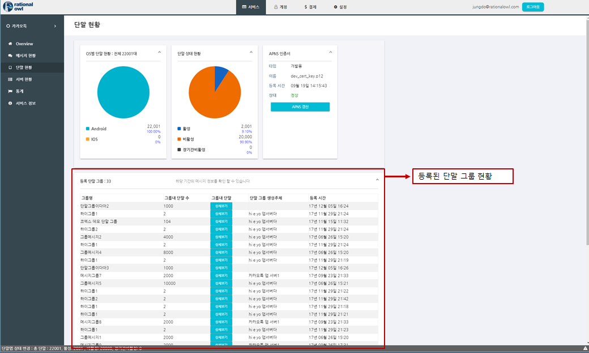
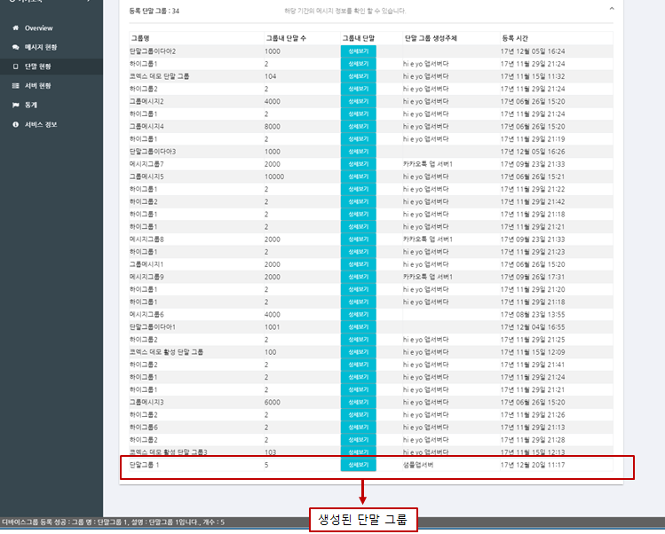

# 래셔널아울 Rest API 앱서버 샘플

Rest API 앱서버 샘플은 REST API를 이용해서 구현한 예제이다.

## 참고

[데모]()

아래 샘플에서 사용하는 sendHttpRequest() 함수의 구현은 아래와 같다.

```javascript
const sendHttpRequest = (url, data) => {
    const request = new XMLHttpRequest();
    request.open("POST", url, false);
    request.setRequestHeader("Content-Type", "application/json");
    request.send(JSON.stringify(data));

    document.getElementById('response-box').style.visibility = 'visible';
    document.getElementById('response-status').innerText = request.statusText;
    document.getElementById('response-body').innerText = request.responseText;

    return request.responseText;
};
```

## 샘플 프로젝트 실행

본 샘플을 다운로드 후 index.html을 브라우저에서 실행한다.

>래셔널아울 관리자콘솔이 제공하는 실시간 모니터링은 서비스 개발 전 단계에서 실시간 데이터의 전달 현황뿐 아니라 앱서버와 단말의 각 기능 별 성공 여부를 확인할 수 있어 개발속도를 향상시키고 서비스 운영단계에서는 예측 가능성과 서비스 대응력을 높이는 역할을 한다. 샘플 앱 서버 개발시 관리자콘솔을 이용해 각 기능별 동작을 확인함으로써 그 편의성을 확인할 수 있을 것이다.

## 앱서버 등록

```javascript
const registerServerRun = () => {
    const serviceId = document.getElementById('register-service-id').value;
    const registerName = document.getElementById('register-name').value;
    const response = sendHttpRequest('http://gate.rationalowl.com:8006/server/register/', {
        serviceId, registerName
    });
    channelUrl = JSON.parse(response).channelServer;
};
```

### Parameter

- serviceId
  - 앱 서버가 등록할 서비스의 아이디
  - service 등록 시 발급받는 아이디로 '관리자 콘솔 > 서비스 정보'에서 확인 가능
- registerName
  - 앱 서버를 콘솔에서 표시할 이름
  - 콘솔에서 앱서버를 확인하는 용도로 이용

### Result

```javascript
{
  "serviceId":"service id here",
  "registerName":"displayed app server name"
}
```

래셔널아울 관리자 콘솔은 앱서버 상태에 대해 실시간 모니터링을 제공한다. 앱서버 등록시 래셔널아울 관리자 콘솔의 '서비스 > 서버 현황'에서 실시간 확인 가능하다.


## 앱서버 등록 해제

```javascript
const unregisterServerRun = () => {
    const serviceId = document.getElementById('unregister-service-id').value;
    const serverRegId = document.getElementById('unregister-id').value;
    sendHttpRequest('http://gate.rationalowl.com:8006/server/unregister/', {
        serviceId, serverRegId
    });
};
```

### Parameter

- serviceId
  - 앱 서버가 등록할 서비스의 아이디 
  - service 등록 시 발급받는 아이디로 콘솔 서비스 정보에서 확인 가능
- serverRegId
  - 등록 시 발급받은 앱 서버 등록 아이디

### Result

```javascript
{
}
```

>## 단말그룹 관리

관리자콘솔의 '서비스 > 단말 현황'에 등록된 단말 그룹의 현황을 확인 할 수 있다.



## 단말그룹 생성

```javascript
const deviceGroupCreateRun = () => {
    const serviceId = document.getElementById('device-group-create-service-id').value;
    const serverRegId = document.getElementById('device-group-create-register-id').value;
    const groupName = document.getElementById('device-group-create-name').value;
    const deviceList = document.getElementById('device-group-create-devices').value.replace(/\s/g, '').split(/,/g);
    const description = document.getElementById('device-group-create-description').value;

    sendHttpRequest(`http://${channelUrl}/deviceGroup/create/`, {
        serviceId, serverRegId, groupName, deviceList, description
    });
};
```

### Parameter

- serviceId
  - service 등록 시 발급받는 아이디로 콘솔 서비스 정보에서 확인 가능
- serverRegId
  - 등록 시 발급받은 앱 서버 등록 아이디
- groupName
  - 그룹명
  - 콘솔에서 디스플레이되는 이름
- deviceList
  - 단말 그룹에 포함될 단말 리스트
  - 최대 2천개까지 포함 가능
  - 2천개 이상 단말은 단말 그룹 생성 후 add device group을 통해 추가 가능.
- description
  - 단말 그룹 설명
  - 콘솔에서 디스플레이

### Result

```javascript
{
  "groupId":"asdfasfd",
  "deviceSize":2000,
  "failedDevice":["deviceRegId21",.."deviceRegId233"]
}
```

관리자 콘솔의 '서비스 > 단말 현황'에서 단말 그룹을 보면 실시간으로 단말 그룹이 생성되는 것을 확인 할 수 있다.



## 단말그룹 내 단말 추가

```javascript
const deviceGroupAddRun = () => {
    const serviceId = document.getElementById('device-group-add-service-id').value;
    const serverRegId = document.getElementById('device-group-add-register-id').value;
    const groupId = document.getElementById('device-group-add-id').value;
    const deviceList = document.getElementById('device-group-add-devices').value.replace(/\s/g, '').split(/,/g);

    sendHttpRequest(`http://${channelUrl}/deviceGroup/add/`, {
        serviceId, serverRegId, groupId, deviceList
    });
};
```

### Parameter

- serviceId
  - service 등록 시 발급받는 아이디로 콘솔 서비스 정보에서 확인 가능
- serverRegId
  - 등록 시 발급받은 앱 서버 등록 아이디
- groupId
  - 단말을 추가할 그룹의 그룹 아이디
- deviceList
  - 단말 그룹에 추가할 단말 리스트
  - 최대 2천개까지 포함 가능

### Result

```javascript
{
  "groupId":"asdfasfd",
  "totaldeviceSize":22000,
  "addedDeviceSize":1800,
  "failedDevice":["deviceRegId21",.."deviceRegId233"]
}
```

관리자 콘솔의 '서비스 > 단말 현황'에서 단말 그룹을 보면 단말 그룹내 단말 수가 5대에서 10대로 늘어난 것을 확인 할 수 있다.


## 단말그룹 내 단말 제거

```javascript
const deviceGroupSubtractRun = () => {
    const serviceId = document.getElementById('device-group-subtract-service-id').value;
    const serverRegId = document.getElementById('device-group-subtract-register-id').value;
    const groupId = document.getElementById('device-group-subtract-id').value;
    const deviceList = document.getElementById('device-group-subtract-devices').value.replace(/\s/g, '').split(/,/g);

    sendHttpRequest(`http://${channelUrl}/deviceGroup/subtract/`, {
        serviceId, serverRegId, groupId, deviceList
    });
};
```

### Parameter

- serviceId
  - service 등록 시 발급받는 아이디로 콘솔 서비스 정보에서 확인 가능
- serverRegId
  - 등록 시 발급받은 앱 서버 등록 아이디
- groupId
  - 단말을 추가할 그룹의 그룹 아이디
- deviceList
  - 단말 그룹에서 삭제할 단말 리스트
  - 최대 2천개까지 포함 가능

### Result

```javascript
{
  "groupId":"asdfasfd",
  "totaldeviceSize":22000,
  "removedDeviceSize":1800,
  "failedDevice":["deviceRegId21",.."deviceRegId233"]
}
```

관리자 콘솔의 '서비스 > 단말 현황'에서 단말 그룹을 보면 단말 그룹내 단말 수가 10대에서 7대로 줄어든 것을 확인 할 수 있다.


## 단말그룹 삭제

```javascript
const deviceGroupRemoveRun = () => {
    const serviceId = document.getElementById('device-group-remove-service-id').value;
    const serverRegId = document.getElementById('device-group-remove-register-id').value;
    const groupId = document.getElementById('device-group-remove-id').value;

    sendHttpRequest(`http://${channelUrl}/deviceGroup/remove/`, {
        serviceId, serverRegId, groupId
    });
};
```

### Parameter

- serviceId
  - service 등록 시 발급받는 아이디로 콘솔 서비스 정보에서 확인 가능
- serverRegId
  - 등록 시 발급받은 앱 서버 등록 아이디
- groupId
  - 삭제할 단말 그룹 아이디

### Result

```javascript
{
}
```

관리자 콘솔의 '서비스 > 단말 현황'에서 샘플데모에서 생성한 '단말그룹1' 단말그룹이 삭제된 것을 확인할 수 있다.


>## 실시간 메시지 수/발신

관리자콘솔의 '서비스 > 메시지 현황'에서 실시간 메시지 전달 모니터링이 가능하다.


## 멀티캐스트 발신

```javascript
const multicastRun = () => {
    const serviceId = document.getElementById('multicast-service-id').value;
    const serverRegId = document.getElementById('multicast-register-id').value;
    const queuing = Number(document.getElementById('multicast-queueing').value);
    const data = document.getElementById('multicast-data').value;
    const deviceRegIds = document.getElementById('multicast-devices').value.replace(/\s/g, '').split(/,/g);
    const notiTitle = document.getElementById('multicast-noti-title').value;
    const notiBody = document.getElementById('multicast-noti-body').value;

    sendHttpRequest(`http://${channelUrl}/downstream/multicast/`, {
        serviceId, serverRegId, queuing, data, deviceRegIds, notiTitle, notiBody
    });
};
```

### Parameter


- serviceId
  - service 등록 시 발급받는 아이디로 콘솔 서비스 정보에서 확인 가능
- serverRegId
  - 등록 시 발급받은 앱 서버 등록 아이디
- deviceRegIds
  - 메시지를 전달할 대상 단말의 단말 등록 아이디 목록
  - 단말앱이 최초 설치시 단말 앱 등록 시 발급받는 아이디로 발급 후
    앱 서버로 전달해 줘야 한다.
  - 앱 서버는 전달 받은 단말 등록 아이디를 저장/관리해야 한다.
  - 최대 2000대까지 제한
- queuing
  - 메시지 큐잉 지원 여부로 단말이 비 활성시 큐잉기간(기본 3일)동안 메시지를 래셔널아울서버에서 보관하고 있다가 단말이 활성 시 전달할지 여부
  - 1 : 지원
  - 0 : 미지원
- data
  - 단말앱에 전달할 데이터
  - 스트링으로 포맷은 json, 일반 스트링 고객 서비스 성격에 맞게 선택
  - 선택 필드인 noti 필드가 부재시 알림창에도 이용
- notiTitle
  - 알림 제목 : 단말앱이 백그라운드/종료시 알림창에 표시할 제목
- notiBody
  - 알림 내용 : 단말앱이 백그라운드/종료시 알림창에 표시할 내용, 미설정시 data가 표시

### Result

```javascript
{
    "mId":"message id here"
}
```

관리자 콘솔의 '서비스 > 메시지 현황'에서 실시간으로 메시지 전달현황을 확인 할 수 있다.


## 브로드캐스트 발신

```javascript
const broadcastRun = () => {
    const serviceId = document.getElementById('broadcast-service-id').value;
    const serverRegId = document.getElementById('broadcast-register-id').value;
    const queuing = Number(document.getElementById('broadcast-queueing').value);
    const data = document.getElementById('broadcast-data').value;
    const notiTitle = document.getElementById('broadcast-noti-title').value;
    const notiBody = document.getElementById('broadcast-noti-body').value;

    sendHttpRequest(`http://${channelUrl}/downstream/broadcast/`, {
        serviceId, serverRegId, queuing, data, notiTitle, notiBody
    });
};
```

### Parameter

- serviceId
  - service 등록 시 발급받는 아이디로 콘솔 서비스 정보에서 확인 가능
- serverRegId
  - 등록 시 발급받은 앱 서버 등록 아이디
- queuing
  - 메시지 큐잉 지원 여부로 단말이 비 활성시 큐잉기간(기본 3일)동안 메시지를 래셔널아울서버에서 보관하고 있다가 단말이 활성 시 전달할지 여부
  - 1 : 지원
  - 0 : 미지원
- data
  - 단말앱에 전달할 데이터
  - 스트링으로 포맷은 json, 일반 스트링 고객 서비스 성격에 맞게 선택
  - 선택 필드인 noti 필드가 부재 시 알림 용도로도 이용
- notiTitle
  - 알림 제목 : 단말앱이 백그라운드/종료시 알림창에 표시할 제목
- notiBody
  - 알림 내용 : 단말앱이 백그라운드/종료시 알림창에 표시할 내용, 미설정시 data가 표시

### Result

```javascript
{
    "mId":"message id here"
}
```

관리자 콘솔의 '서비스 > 메시지 현황'에서 실시간으로 메시지 전달현황을 확인 할 수 있다. 콘솔에서 전달 2001 단말, 미전달 단말이 20000단말이다.


'서비스 > 단말 현황'에서 서비스에 등록된 모든 단말이 22,001대이고 그 중 활성상태(동접상태)가 2,001대로 메시지 전달률과 일치함을 알 수 있다. 참고로 다운스트림은 기본 3일간 큐잉을 지원하며 해당 기간 내에 단말앱이 활성상태가 되면 미전달 메시지를 바로 전달한다.


## 그룹메시지 발신

```javascript
const groupmsgRun = () => {
    const serviceId = document.getElementById('groupmsg-service-id').value;
    const serverRegId = document.getElementById('groupmsg-register-id').value;
    const queuing = Number(document.getElementById('groupmsg-queueing').value);
    const data = document.getElementById('groupmsg-data').value;
    const groupId = document.getElementById('groupmsg-group-id').value;
    const notiTitle = document.getElementById('groupmsg-noti-title').value;
    const notiBody = document.getElementById('groupmsg-noti-body').value;

    sendHttpRequest(`http://${channelUrl}/downstream/group/`, {
        serviceId, serverRegId, queuing, data, groupId, notiTitle, notiBody
    });
};
```

### Parameter

- serviceId
  - service 등록 시 발급받는 아이디로 콘솔 서비스 정보에서 확인 가능
- serverRegId
  - 등록 시 발급받은 앱 서버 등록 아이디
- groupId
  - 단말 그룹 아이디
- queuing
  - 메시지 큐잉 지원 여부로 단말이 비 활성시 큐잉기간(기본 3일)동안
    메시지를 래셔널아울서버에서 보관하고 있다가 단말이 활성 시 전달할지 여부
  - 1 : 지원
  - 0 : 미지원
- data
  - 단말앱에 전달할 데이터
  - 스트링으로 포맷은 json, 일반 스트링 고객 서비스 성격에 맞게 선택
  - 선택 필드인 noti 필드가 부재 시 알림 용도로도 이용
- notiTitle
  - 알림 제목 : 단말앱이 백그라운드/종료시 알림창에 표시할 제목
- notiBody
  - 알림 내용 : 단말앱이 백그라운드/종료시 알림창에 표시할 내용, 미설정시 data가 표시

### Result

```javascript
{
    "mId":"message id here"
}
```

관리자 콘솔의 '서비스 > 메시지 현황'에서 실시간으로 메시지 전달현황을 확인 할 수 있다. 


