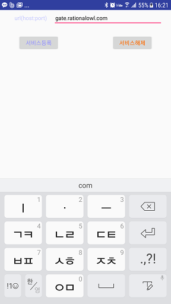

# 래셔널아울 Android 단말앱 샘플
Android 단말앱 샘플은 Android 단말앱 라이브러리에서 제공하는 API를 이용해서 단말앱을 만드는 것을 쉽게 따라할 수 있도록 쉽게 작성되었다.

## 샘플 프로젝트 설정
1. github에서 샘플코드를 다운받는다.
2. 안드로이드 스튜디오를 실행한다.
3. 'File > New > Import Project..'
4. 다운받은 폴더를 선택하면 아래 그림과 같이 실행가능한 샘플 프로젝트 환경을 확인 할 수 있다.
5. 'app > libs' 폴더의 'rationalowl-andoird-x.x.x.aar' 파일이 래셔널아울 Android 단말앱 라이브러리이다.


### 샘플앱 실행

안드로이드 단말을 PC에 연결 후 안드로이드 스튜디오에서 실행시키면 실제 안드로이드 단말에 샘플앱이 설치 후 실행된다.


래셔널아울 관리자콘솔이 제공하는 실시간 모니터링은 서비스 개발 전 단계에서 실시간 데이터의 전달 현황뿐 아니라 개발 단계에서 앱서버와 단말앱의 각 기능 별 성공 여부를 확인할 수 있어 개발속도를 향상시키고 서비스 운영단계에서는 예측 가능성과 서비스 대응력을 높이는 역할을 한다. 샘플앱 개발시 관리자콘솔을 이용해 각 기능별 동작을 확인함으로써 그 편의성을 확인할 수 있을 것이다.

>## 단말앱 초기화
샘플코드에서 MinervaManager.init를 검색하면 아래의 샘플코드를 확인할 수 있다. 해당 API는 안드로이드 단말앱 초기화 루틴에 위치시켜 단말앱 라이브러리를 가용한 상태로 만든다.      
샘플코드에서처럼 Application 클래스의 onCreate()에서 호출하도록 권고한다.


```java
public class Service1App extends Application {
    private static final String TAG = "MyApp";

    private static Context context;
    

    public void onCreate(){
        Log.d(TAG, "onCreate enter");
        super.onCreate();
        context = getApplicationContext();
        MinervaManager.init(context);
    }


    public static Context getContext() {
        return context;
    }
}
```

>## 단말앱 등록

샘플 단말앱에서 단말앱 등록하기 위해서는 다음 절차를 따르면 된다.

1. 샘플앱 초기 화면에서 메뉴를 클릭
2. register/un-register 클릭
3. 등록화면에서 서비스등록 버튼 클릭


샘플코드에서 registerDevice를 검색하면 아래의 샘플코드를 확인할 수 있다. 


```java
public void onClick(View v) {
    switch (v.getId()) {
        case R.id.regBtn: {
            String gateHost = mUrlEt.getText().toString();
            MinervaManager mgr = MinervaManager.getInstance(this);
            mgr.registerDevice(gateHost, "faebcfe844d54d449136491fb253619d", "단말등록이름"); 
            break;

        }        
        default:
            break;
    }        
}      
```

MinervaManager.registerDevice() API의 각 인자별 의미는 다음과 같다.

1. gateHost
 - 래셔널아울 메시징 게이트 서버
 - 국가별로 별도로 존재
 - 무료평가판의 경우 기본 "gate.rationalowl.com"
2. serviceId 
 - 단말앱이 등록하고자하는 모바일 서비스의 아이디
 - 관리자콘솔의 '서비스 > 서비스정보'에서 확인
 - 단말앱이 등록 후 해당 모바일 서비스에 등록한 모든 단말앱 및 앱서버와 실시간 메시지를 수/발신 할 수 있다.
3. deviceRegName 
 - 관리자콘솔에서 단말을 구분하기 위한 용도
 - 사용하지 않을 경우 null로 입력하면 된다.

간단히 샘플코드에서 MinervaManager.registerDevice() API의 2번째 서비스 아이디를 실제 래셔널아울 관리자 콘솔로 등록한 서비스 아이디로 대체해서 실행시키면 단말이 등록되는 것을 관리자 콘솔의 '서비스 > 단말현황'에서 실시간 모니터링 할 수 있다.


### 단말앱 등록 결과

소스코드에서 ACTION_MINERVA_DEVICE_REGISTER_RESULT를 검색하면 아래의 샘플코드를 확인 할 수 있다.

```java
public void onReceive(Context context, Intent intent) {
    String action = intent.getAction();    

    if(action.equals(MinervaManager.ACTION_MINERVA_DEVICE_REGISTER_RESULT)) {
        Bundle bundle = intent.getExtras();
        int resultCode = bundle.getInt("resultCode");    
        String msg = null;
        // yes registration has completed successfully!
        if(resultCode == Result.RESULT_OK) {
            String deviceRegId = bundle.getString("deviceRegId");
            MyData data = MyData.getInstance();
            // save and manage deviceRegId
            data.setDeviceRegId(deviceRegId);            
            msg = "registration success !!\n" + "registration id : " + deviceRegId;

            //TODO : should sendUpstream deviceRegId to the app server which should communicate with
            /*
            String data = deviceRegId;
            String serverRegId = "server registration id which should be communicated!";
            MinervaManager minMgr = MinervaManager.getInstance(this);
            minMgr.sendUpstreamMsg(msg, serverRegId);
            */

        }
        else if(resultCode == Result.RESULT_DEVICE_ALREADY_REGISTERED) {
            String deviceRegId = bundle.getString("deviceRegId");
            MyData data = MyData.getInstance();
            data.setDeviceRegId(deviceRegId);
            msg = bundle.getString("resultMsg") + "!!\n" + "registration id : " + deviceRegId;
        }
        //registration error has occurred!
        else {
            msg = bundle.getString("resultMsg");
        }
        Log.d(TAG, msg);
        Toast.makeText(context, msg, Toast.LENGTH_LONG).show();           
    } 
    ...
} 
```

단말앱 등록이 성공되면 발급받은 단말 등록 아이디를 단말앱은 저장 및 관리해야 하고 해당 단말 등록 아이디를 단말앱을 관리 및 통신할 대상 앱서버에게 업스트림 API를 통해 전달해야 한다.
마찬가지로 앱서버는 전달받은 단말 등록 아이디를 저장 및 관리해야 한다.

단말앱 등록 결과 반환받는 값들은 다음과 같다.

 1. 단말 등록 아이디
    - 샘플코드에서 bundle.getString("deviceRegId")로 반환
    - 단말 앱을 구분하는 구분자
    - 단말앱 등록 성공이거나 기등록된 경우 전달받는다.
    - 단말앱 등록 성공일 경우 이를 앱 서버에게 upstream API를 통해 전달해야 한다.
 2. 결과 코드
    - 샘플코드에서 bundle.getInt("resultCode")로 반환
 3. 결과 메시지
    - 샘플코드에서 bundle.getString("resultMsg")로 반환


## 단말앱 등록해제

샘플 단말앱에서 단말앱 등록하기 위해서는 다음 절차를 따르면 된다.

1. 샘플앱 초기 화면에서 메뉴를 클릭
2. register/un-register 클릭
3. 등록화면에서 서비스해제 버튼 클릭




샘플코드에서 unregisterDevice 검색하면 아래의 샘플코드를 확인할 수 있다. 

```java
public void onClick(View v) {
    switch (v.getId()) {
        ...
        case R.id.unregBtn:
            MinervaManager mgr = MinervaManager.getInstance(this);
            mgr.unregisterDevice("faebcfe844d54d449136491fb253619d");           
            break;
        default:
            break;
    }        
```

MinervaManager.unregisterDevice() API의 각 인자별 의미는 다음과 같다.
1. serviceId 
 - 단말앱이 등록해제하고자하는 모바일 서비스의 아이디
 - 관리자콘솔의 '서비스 > 서비스정보'에서 확인가능

간단히 샘플코드에서 MinervaManager.unregisterDevice() API의 서비스 아이디를 실제 래셔널아울 관리자 콘솔로 등록한 서비스 아이디로 대체해서 실행시키면 단말이 등록해제되는 것을 관리자 콘솔의 '서비스 > 단말현황'에서 실시간 모니터링 할 수 있다.


### 단말앱 등록해제 결과

소스코드에서 ACTION_MINERVA_DEVICE_UNREGISTER_RESULT 검색하면 아래의 샘플코드를 확인 할 수 있다.

```java
 public void onReceive(Context context, Intent intent) {
    String action = intent.getAction();    
    
    if(action.equals(MinervaManager.ACTION_MINERVA_DEVICE_REGISTER_RESULT)) {
        ...
    }                
    else if(action.equals(MinervaManager.ACTION_MINERVA_DEVICE_UNREGISTER_RESULT)) {
        Log.d(TAG, "onReceive 2 " + action);       
        Bundle bundle = intent.getExtras();
        int resultCode = bundle.getInt("resultCode");    
        String msg = null;
        //yes unregistration has completed successfully!
        if(resultCode == Result.RESULT_OK) {
            String deviceRegId = bundle.getString("deviceRegId");           
        }          
        //registration error has occurred!
        else {
            // error message
            msg = bundle.getString("resultMsg");
        }                    
    }
    ... 
 }  
```

단말앱 등록해제 결과 단말앱 라이브러리는 단말앱에 다음의 값들을 알려준다.

 1. 단말 등록 아이디
    - 샘플코드에서 bundle.getString("deviceRegId")로 반환
    - 단말 앱을 구분하는 구분자
 2. 결과 코드
    - 샘플코드에서 bundle.getInt("resultCode")로 반환
 3. 결과 메시지
    - 샘플코드에서 bundle.getString("resultMsg")로 반환


## 업스트림 메시지 발신

샘플 단말앱에서 업스트림 메시지를 발신하기 위해서는 다음 절차를 따르면 된다.

1. 샘플앱 초기 화면에서 메뉴를 클릭
2. push message 클릭
3. 메시지화면에서 전송할 데이터를 텍스트 필드에 입력 후 'UPSTREAM' 버튼 클릭


샘플코드에서 sendUpstreamMsg 검색하면 아래의 샘플코드를 확인할 수 있다. 


```java
public void onClick(View v) {
    String msg = et.getText().toString();
    
    switch (v.getId()) {
        case R.id.upBtn: {
            Calendar cal = Calendar.getInstance();
            String curTimeStr = cal.get(Calendar.YEAR) + "/" + (cal.get(Calendar.MONTH) + 1) + "/" + cal.get(Calendar.DAY_OF_MONTH) + "/" + cal.get(Calendar.HOUR_OF_DAY) + ":" + cal.get(Calendar.MINUTE) + ":" + cal.get(Calendar.SECOND);
            
            MsgCache cache = MsgCache.getInstance();
            PushMsg pushMsg = new PushMsg();
            pushMsg.mData = "=>" + msg;
            pushMsg.mSrcTime = curTimeStr;
            pushMsg.mDestTime = curTimeStr;
            pushMsg.mElapsedTime = 0;
            cache.addMsg(pushMsg);
            
            mListAdapter.notifyDataSetChanged();
            String serverRegId = "513bb7114fc04ffbbd5f7ff6da173f97";
            MinervaManager minMgr = MinervaManager.getInstance(this);
            //manage umi(upstream message id) to check upstream delivery
            // when ACTION_MINERVA_UPSTREAM_MSG_RESULT fires
            String requestId = minMgr.sendUpstreamMsg(msg, serverRegId);
            // manage umi if you want to check later
            break;
        }
        case R.id.p2pBtn:                
           ...
        default:
            break;
    }        
    
}
```

MinervaManager.sendUpstreamMsg() API의 각 인자별 의미는 다음과 같다.

1. msg
 - 전달할 데이터로 모바일 서비스 특성에 맞게 json포맷 또는 일반 스트링으로 포맷팅하면 된다.
2. serverRegId 
 - 데이터를 전달할 앱서버의 등록아이디
 - 관리자콘솔의 '서비스 > 서버현황'에서 확인 가능

샘플코드에서 MinervaManager.sendUpstreamMsg() API의 serverRegId를 실제 등록한 앱서버 등록 아이디로 대체해서 실행시키면 해당 앱서버로 실시간 메시지가 전달되는 것을 확인할 수 있다.
그리고 메시지 전달현황은 관리자 콘솔의 '서비스 > 메시지현황'에서 실시간 모니터링 할 수 있다.

### 업스트림 메시지 발신 결과

소스코드에서 ACTION_MINERVA_UPSTREAM_MSG_RESULT 검색하면 아래의 샘플코드를 확인 할 수 있다.

```java
 public void onReceive(Context context, Intent intent) {
    String action = intent.getAction();    
    
    else if(action.equals(MinervaManager.ACTION_MINERVA_UPSTREAM_MSG_RESULT)) {
        Log.d(TAG, "onReceive" + action);                        
        Bundle bundle = intent.getExtras();
        int resultCode = bundle.getInt("resultCode");    
        String resultMsg = bundle.getString("resultMsg");
        //umi(upstream message id) 
        String umi = bundle.getString("umi");
        //yes upstream message success
        if(resultCode == Result.RESULT_OK) {
            //do something
            Log.d(TAG, "upstream success umi = " + umi);
        }          
        //upstream message fail
        else {
            //do something.
            Log.d(TAG, "upstream fail umi = " + umi);
        }       
    }            
    ... 
 }  
```

단말앱 라이브러리는 단말앱에 다음의 값들을 알려준다.

 1. upstream message id
    - 샘플코드에서 bundle.getString("umi")로 반환
    - minMgr.sendUpstreamMsg(msg, serverRegId)의 반환값과 동일하다.
    - 업스트림 발신 결과와 sendUpstreamMsg() API 호출원을 검증하는 용도
 2. 결과 코드
    - 샘플코드에서 bundle.getInt("resultCode")로 반환
 3. 결과 메시지
    - 샘플코드에서 bundle.getString("resultMsg")로 반환


## P2P 메시지 발신

샘플 단말앱에서 P2P 메시지를 발신하기 위해서는 다음 절차를 따르면 된다.

1. 샘플앱 초기 화면에서 메뉴를 클릭
2. push message 클릭
3. 메시지화면에서 전송할 데이터를 텍스트 필드에 입력 후 'P2P' 버튼 클릭


샘플코드에서 sendP2PMsg 검색하면 아래의 샘플코드를 확인할 수 있다. 


```java
public void onClick(View v) {
    String msg = et.getText().toString();
    
    switch (v.getId()) {
        case R.id.upBtn: {
            ...
        }
        case R.id.p2pBtn:                
            Calendar cal = Calendar.getInstance();
            String curTimeStr = cal.get(Calendar.YEAR) + "/" + (cal.get(Calendar.MONTH) + 1) + "/" + cal.get(Calendar.DAY_OF_MONTH) + "/" + cal.get(Calendar.HOUR_OF_DAY) + ":" + cal.get(Calendar.MINUTE) + ":" + cal.get(Calendar.SECOND);
            
            MsgCache cache = MsgCache.getInstance();
            PushMsg pushMsg = new PushMsg();
            pushMsg.mData = "=>(p2p)" + msg;
            pushMsg.mSrcTime = curTimeStr;
            pushMsg.mDestTime = curTimeStr;
            pushMsg.mElapsedTime = 0;
            cache.addMsg(pushMsg);

            mListAdapter.notifyDataSetChanged();          

            MinervaManager minMgr = MinervaManager.getInstance(this);
            //manage pmi(p2p message id) to check p2p delivery            
            String pmi = minMgr.sendP2PMsg(msg, destDevices);
            // manage pmi if you want to check later
            break;
        default:
            break;
    }
}
```

MinervaManager.sendP2PMsg() API의 각 인자별 의미는 다음과 같다.

1. msg
 - 전달할 데이터로 모바일 서비스 특성에 맞게 json포맷 또는 일반 스트링으로 포맷팅하면 된다.
2. destDevices 
 - 데이터를 전달할 대상 단말앱들의 단말등록아이디 목록
 - 최대 2000대까지 가능

샘플코드에서 MinervaManager.sendP2PMsg() API의 destDevices에 실제 등록한 한개 이상의 단말 등록 아이디로 대체해서 실행시키면 해당 단말앱으로 실시간 메시지가 전달되는 것을 확인할 수 있다.
그리고 메시지 전달현황은 관리자 콘솔의 '서비스 > 메시지현황'에서 실시간 모니터링 할 수 있다.

### P2P 메시지 발신 결과

소스코드에서 ACTION_MINERVA_P2P_MSG_RESULT 검색하면 아래의 샘플코드를 확인 할 수 있다.

```java
 public void onReceive(Context context, Intent intent) {
    String action = intent.getAction();    
    
    else if(action.equals(MinervaManager.ACTION_MINERVA_P2P_MSG_RESULT)) {
        Log.d(TAG, "onReceive" + action);                        
        Bundle bundle = intent.getExtras();
        int resultCode = bundle.getInt("resultCode");    
        String resultMsg = bundle.getString("resultMsg");
        //pmi(P2P message id) 
        String pmi = bundle.getString("pmi");
        //yes upstream message success
        if(resultCode == Result.RESULT_OK) {
            //do something
            Log.d(TAG, "P2P send success pmi = " + pmi);
        }          
        //upstream message fail
        else {
            //do something.
            Log.d(TAG, "upstream fail pmi = " + pmi);
        }       
    }            
    ... 
 }  
```

단말앱 라이브러리는 단말앱에 다음의 값들을 알려준다.

 1. P2P message id
    - 샘플코드에서 bundle.getString("pmi")로 반환
    - minMgr.sendP2PMsg() API의 반환값과 동일하다.
    - P2P 메시지 발신 결과와 sendP2PMsg() API 호출원을 검증하는 용도
 2. 결과 코드
    - 샘플코드에서 bundle.getInt("resultCode")로 반환
 3. 결과 메시지
    - 샘플코드에서 bundle.getString("resultMsg")로 반환


## 메시지 수신
단말앱은 앱서버로부터의 다운스트림 메시지와 다른 단말앱으로부터의 P2P 메시지를 수신한다. 

### 다운스트림 메시지 수신

소스코드에서 ACTION_MINERVA_PUSH_MSG_RECEIVED 검색하면 아래의 샘플코드를 확인 할 수 있다.

```java
 public void onReceive(Context context, Intent intent) {
    String action = intent.getAction();    
    
    else if(action.equals(MinervaManager.ACTION_MINERVA_PUSH_MSG_RECEIVED)) {
        Log.d(TAG, "onReceive 2 " + action);                            
        Bundle bundle = intent.getExtras();
        int msgSize = bundle.getInt(MinervaManager.FIELD_MSG_SIZE);
        String jsonStr = bundle.getString(MinervaManager.FIELD_MSG_LIST);
        //example..
        /*
        try {
            ArrayList<Map<String, Object>> testJson = mapper.readValue(jsonStr, new TypeReference<ArrayList<Map<String, Object>>>() {});
            
            for(int i = 0; i < msgSize; i++) {
                Map<String, Object> oneMsg = testJson.get(i);
                String sender = (String)oneMsg.get(MinervaManager.FIELD_MSG_SENDER);
                String data = (String)oneMsg.get(MinervaManager.FIELD_PUSH_DATA);
                long serverTime = (Long)oneMsg.get(MinervaManager.FIELD_PUSH_SERVER_TIME);                    
                long notiTitle = (Long)oneMsg.get(MinervaManager.FIELD_MSG_NOTI_TITLE);                    
                long notiBody = (Long)oneMsg.get(MinervaManager.FIELD_MSG_NOTI_BODY);                   
            }
            
            System.out.println();
        }
        catch(Exception e) {
            e.printStackTrace();
        }
        //example end
            * */           
        Intent sendIntent = new Intent(context, MyService.class);
        sendIntent.putExtra(MyService.SERVICE_TYPE, MyService.SERVICE_TYPE_PUSH_MSG_RECEIVED);
        Object[] argv = new Object[2];
        argv[0] = msgSize;
        argv[1] = jsonStr;
        sendIntent.putExtra(MyService.SERVICE_ARGV, argv);      
        context.startService(sendIntent);         
    }  
... 
}  
```


앱서버에서 발신하는 멀티캐스트, 브로드캐스트, 그룹 메시지를 단말앱이 수신시 단말앱 라이브러리는 단말앱에게 다음의 값들을 알려준다.

1. 다운스트림 메시지 갯수    
  - 샘플코드에서 bundle.getInt(MinervaManager.FIELD_MSG_SIZE)로 반환
2. 다운스트림 메시지 목록    
   샘플코드에서 bundle.getString(MinervaManager.FIELD_MSG_LIST)로 반환     
   메시지 목록의 각 메시지는 다음의 값들을 포함한다.
  - 메시지 발신한 앱서버의 서버등록아이디
  - 메시지 데이터
  - 메시지 발신시간
  - 단말앱이 백그라운드시 표시할 알림 타이틀
  - 단말앱이 백그라운드시 표시할 알림 본문

샘플앱이 메시지 수신시 백그라운드일 경우에는 알림이 오고 샘플앱이 포그라운드일 경우 샘플앱의 메시지 면에서 메시지 수신됨을 확인 가능하다.


### P2P 메시지 수신

소스코드에서 ACTION_MINERVA_P2P_MSG_RECEIVED 검색하면 아래의 샘플코드를 확인 할 수 있다.

```java
 public void onReceive(Context context, Intent intent) {
    String action = intent.getAction();    
    
    else if(action.equals(MinervaManager.ACTION_MINERVA_P2P_MSG_RECEIVED)) {
        Log.d(TAG, "onReceive 2 " + action);            
        //jungdo_for_test
        //String serverURL = intent.getExtras().getString("serverURL");            
        Bundle bundle = intent.getExtras();
        int msgSize = bundle.getInt(MinervaManager.FIELD_MSG_SIZE);
        String jsonStr = bundle.getString(MinervaManager.FIELD_MSG_LIST);
        //example..
        /*
        try {
            ArrayList<Map<String, Object>> testJson = mapper.readValue(jsonStr, new TypeReference<ArrayList<Map<String, Object>>>() {});
            
            for(int i = 0; i < msgSize; i++) {
                Map<String, Object> oneMsg = testJson.get(i);
                String sender = (String)oneMsg.get(MinervaManager.FIELD_MSG_SENDER);
                String data = (String)oneMsg.get(MinervaManager.FIELD_PUSH_DATA);
                long serverTime = (Long)oneMsg.get(MinervaManager.FIELD_PUSH_SERVER_TIME);                    
                long notiTitle = (Long)oneMsg.get(MinervaManager.FIELD_MSG_NOTI_TITLE);                    
                long notiBody = (Long)oneMsg.get(MinervaManager.FIELD_MSG_NOTI_BODY);                    
            }
            
            System.out.println();
        }
        catch(Exception e) {
            e.printStackTrace();
        }
        //example end
        */           
        Intent sendIntent = new Intent(context, MyService.class);
        sendIntent.putExtra(MyService.SERVICE_TYPE, MyService.SERVICE_TYPE_P2P_MSG_RECEIVED);
        Object[] argv = new Object[2];
        argv[0] = msgSize;
        argv[1] = jsonStr;
        sendIntent.putExtra(MyService.SERVICE_ARGV, argv);      
        context.startService(sendIntent);         
    }  
... 
}  
```
모바일 서비스 내 다른 단말앱에서 발신한 P2P 메시지를 단말앱이 수신시 단말앱 라이브러리은 단말앱에게 다음의 값들을 알려준다.

1. P2P 메시지 갯수    
  - 샘플코드에서 bundle.getInt(MinervaManager.FIELD_MSG_SIZE)로 반환
2. P2P 메시지 목록    
   샘플코드에서 bundle.getString(MinervaManager.FIELD_MSG_LIST)로 반환    
   메시지 목록의 각 메시지는 다음의 값들을 포함한다.
  - 메시지 발신한 단말앱의 단말등록아이디
  - 메시지 데이터
  - 메시지 발신시간
  - 단말앱이 백그라운드시 표시할 알림 타이틀
  - 단말앱이 백그라운드시 표시할 알림 본문

샘플앱이 메시지 수신시 백그라운드일 경우에는 알림이 오고 샘플앱이 포그라운드일 경우 샘플앱의 메시지 화면에서 메시지 수신됨을 확인 가능하다.