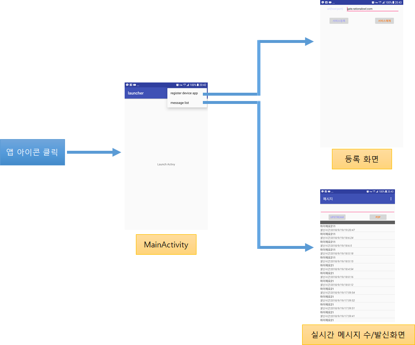
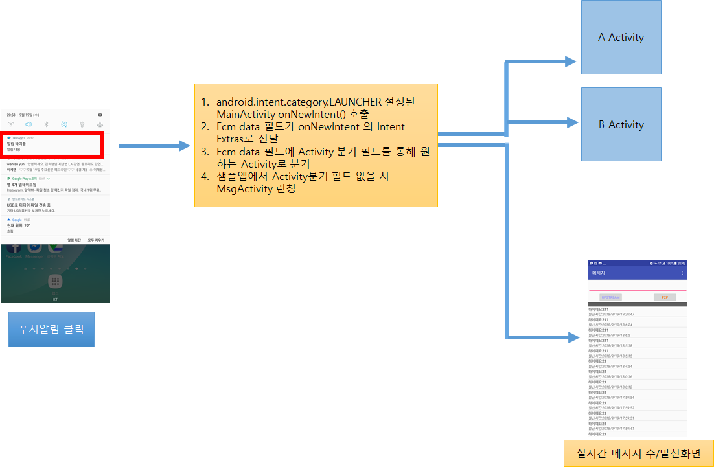
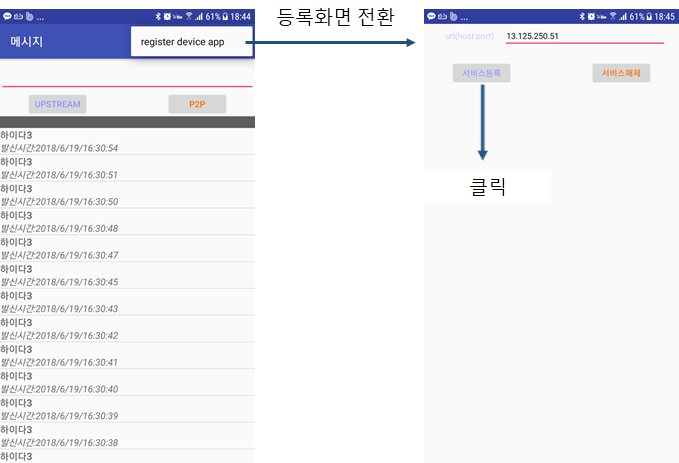
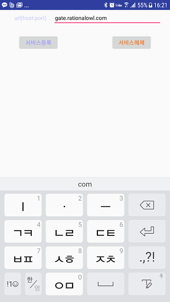
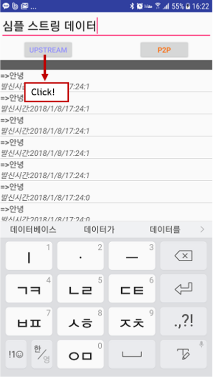
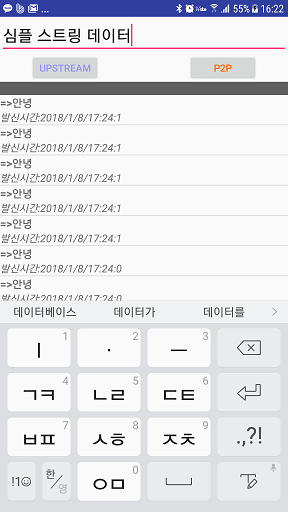

# 래셔널아울 Android 단말앱 샘플
Android 단말앱 샘플은 Android 단말앱 라이브러리에서 제공하는 API를 이용해서 단말앱을 만드는 것을 쉽게 따라할 수 있도록 쉽게 작성되었다.

## 샘플 프로젝트 설정
1. github에서 샘플코드를 다운받는다.
2. 안드로이드 스튜디오를 실행한다.
3. 'File > New > Import Project..'로 샘플앱 프로젝트를 오픈한다.

## 단말앱 라이브러리 적용 확인

래셔널아울 안드로이드 단말앱 라이브러리 적용을 확인한다.

1. 래셔널아울 라이브러리를 적용한다.
    - 아래 build.gradle의 dependencies에서 // RationalOwl library 부분
2. 래셔널아울 이용 라이브러리를 적용한다.
    - 아래 build.gradle의 dependencies에서 // RationalOwl using library 부분   
3. FCM 라이브러리를 적용한다.
    - 아래 build.gradle의 dependencies에서 // FCM library 부분    

아래는 2023년 3월 기준 샘플앱 앱레벨 build.gradle의 dependencies 부분이다.

```java

dependencies {
    implementation fileTree(include: ['*.jar'], dir: 'libs')

    ...
    // RationalOwl library
    implementation name: 'rationalowl-android-1.3.2', ext: 'aar'
    // RationalOwl using library
    implementation "androidx.lifecycle:lifecycle-service:2.5.1"
    implementation "androidx.lifecycle:lifecycle-process:2.5.1"
    // FCM library
    implementation 'com.google.firebase:firebase-core:16.0.6'
    implementation 'com.google.firebase:firebase-messaging:17.3.4'

    ...
}
```


## FCM(Firebase Cloud Messaging) 적용

안드로이드 마쉬멜로 이전에는 백그라운드의 제한이 없어서 안드로이드 단말앱에서 래셔널아울 단말앱 라이브러리를 통해 실시간 푸시 알림이 가능하였다.

그러나 안드로이드 마쉬멜로의 백그라운드 제한과 결정적으로 안드로이드 오레오의 등장으로 사실상 단말앱이 백그라운드시 퍼블릭 푸시가 유일한 알림 수단이 되었다. 
따라서 현재 래셔널아울 서비스도 안드로이드 단말이 백그라운드일 경우 FCM을 통해 알림을 보낸다.
[FCM 설정 가이드](https://github.com/RationalOwl/rationalowl-guide/tree/master/device-app/fcm-setting)를 통해 FCM설정한다.


## 샘플앱 실행

샘플앱 실행은 앱 아이콘 클릭을 통해서 실행되고 푸시 알림 목록의 알림을 탭하여서도 실행된다.

### 앱 아이콘 클릭을 통한 샘플앱 실행

1. 앱 아이콘을 클릭하면 샘플앱에서 android.intent.category.LAUNCHER 으로 지정된 MainActivity가 실행된다.
2. MainActivity의 메뉴>register device app 을 클릭하면 단말앱 등록화면으로 전이한다.
3. MainActivity의 메뉴>message lsit 를 클릭하면 실시간 메시지 수발신 화면으로 전이한다.





### 푸시 알림 탭하여 샘플앱 실행

1. 푸시 알림을 탭하면 샘플앱에서 android.intent.category.LAUNCHER 으로 지정된 MainActivity onNewIntent()가 실행된다.
2. Fcm 발신시 data 필드에 원하는 Activity로 분기하도록 필드를 설정하여 원하는 임의의 Activity로 분기 가능하다.
3. Activity 분기 필드를 별도로 지정하지 않으면 기본적으로 실시간 메시지 수발신 화면으로 전이한다.





### 관리자 콘솔을 통한 모니터링
래셔널아울 관리자콘솔이 제공하는 실시간 모니터링은 서비스 개발 전 단계에서 실시간 데이터의 전달 현황뿐 아니라 개발 단계에서 앱서버와 단말앱의 각 기능 별 성공 여부를 확인할 수 있어 개발속도를 향상시키고 서비스 운영단계에서는 예측 가능성과 서비스 대응력을 높이는 역할을 한다. 샘플앱 개발시 관리자콘솔을 이용해 각 기능별 동작을 확인함으로써 그 편의성을 확인할 수 있을 것이다.


## FCM 안드로이드 단말앱 적용

FCM 푸시 알림을 안드로이드 단말앱에 적용하기 위해서 를 처리하기 위해서는 FirebaseMessagingService 구현해야 한다.

1. FCM 단말 토큰 생성시 호출되는 서비스인 onNewToken(String token) 메소드를 구현한다.
    - 해당 함수내에서 setDeviceToken() API를 호출해야 한다.
    - 샘플앱에서 setDeviceToken을 검색하여 관련 부분을 참조한다.

2. 커스텀(Customizable Push)를 처리하는 onMessageReceived(RemoteMessage remoteMessage)를 구현한다.
    - 해당 함수내에서 enableNotificationTracking() API를 호출해야 한다.
    - 샘플앱에서 enableNotificationTracking을 검색하여 관련 부분을 참조한다.

아래는 2019년 12월 기준 샘플앱의 해당 부분이다.


```java
public class MyFirebaseMessagingService extends FirebaseMessagingService {

    private static final String TAG = "MyFirebaseMsgService";


    /**
     * Called if InstanceID token is updated. This may occur if the security of
     * the previous token had been compromised. Note that this is called when the InstanceID token
     * is initially generated so this is where you would retrieve the token.
     */
    @Override
    public void onNewToken(String token) {
        Logger.debug(TAG, "onNewToken token: " + token);
        // just call setDeviceToken() API
        MinervaManager minMgr = MinervaManager.getInstance();
        minMgr.setDeviceToken(token);
        // there's no need to do anything else
    }


    /**
     * Called when message is received.
     *
     * @param remoteMessage Object representing the message received from Firebase Cloud Messaging.
     */
    // [START receive_message]
    @Override
    public void onMessageReceived(RemoteMessage remoteMessage) {
        Logger.debug(TAG, "onMessageReceived enter");
        Map<String, String> data = remoteMessage.getData();

        // set notification  delivery tracking
        MinervaManager minMgr = MinervaManager.getInstance();
        minMgr.enableNotificationTracking(data);

        // show your custom notification
        showCustomNotification(data);
    }
    ...
}
```


>## 단말앱 초기화
샘플코드에서 MinervaManager.init를 검색하면 아래의 샘플코드를 확인할 수 있다. 해당 API는 안드로이드 단말앱 초기화 루틴에 위치시켜 단말앱 라이브러리를 가용한 상태로 만든다.      
샘플코드에서처럼 Application 클래스의 onCreate()에서 호출하도록 권고한다.


```java
public class Service1App extends Application {
    private static final String TAG = "MyApp";


    public void onCreate(){
        Log.d(TAG, "onCreate enter");
        super.onCreate();
        Context context = getApplicationContext();
        MinervaManager.init(context);
    }

}
```

>## 단말앱 등록

샘플 단말앱에서 단말앱 등록하기 위해서는 다음 절차를 따르면 된다.

1. 샘플앱 초기 화면에서 메뉴를 클릭
2. register/un-register 클릭
3. 등록화면에서 서비스등록 버튼 클릭




샘플코드에서 registerDevice를 검색하면 아래의 샘플코드를 확인할 수 있다. 
주의 할 점은 샘플코드에서처럼 registerDevice() API 호출 전 setDeviceToken() API 호출을 해야 한다.
간단한 방법은 샘플앱처럼 registerDevice() api가 호출되는 activity의 onCreate 콜백에서 FirebaseInstanceId.getInstance().getInstanceId().addOnSuccessListener() 코드를 삽입한다.


* 2020년 3월 기준 주의사항
    - 프로젝트 레벨 build.gradle 파일에 google-service:4.0.0 을 설정해야 버그없이 동작한다.
        - classpath 'com.google.gms:google-services:4.0.0'
    - 프로젝트 레벨 build.gradle 파일의 맨 끝에 다음을 추가해야 동작한다.
        - apply plugin: 'com.google.gms.google-services'
    - 샘플소스를 다운받아 환경을 그대로 이용하면 된다.


```java
    @Override
    public void onCreate(Bundle savedInstanceState) {
        super.onCreate(savedInstanceState);

        FirebaseInstanceId.getInstance().getInstanceId().addOnSuccessListener( this,  new OnSuccessListener<InstanceIdResult>() {
            @Override
            public void onSuccess(InstanceIdResult instanceIdResult) {

                // sometimes, FCM onNewToken() callback not called,
                // So, before registering we need to call it explicitly.
                // simple way is just call setDeviceToken api in the onCreate() callback,
                // which  exist registerDevice API

                String fcmToken = instanceIdResult.getToken();
                MinervaManager mgr = MinervaManager.getInstance();
                mgr.setDeviceToken(fcmToken);
            }
        });
        ...

```

MinervaManager.registerDevice() API의 각 인자별 의미는 다음과 같다.

1. gateHost
 - 래셔널아울 메시징 게이트 서버
 - 국가별로 별도로 존재
 - 무료평가판의 경우 기본 "gate.rationalowl.com"
2. serviceId 
 - 단말앱이 등록하고자하는 모바일 서비스의 아이디
 - 관리자콘솔의 '서비스 > 서비스정보'에서 확인
 - 단말앱이 등록 후 해당 모바일 서비스에 등록한 모든 단말앱 및 앱서버와 실시간 메시지를 수/발신 할 수 있다.
3. deviceRegName 
 - 관리자콘솔에서 단말을 구분하기 위한 용도
 - 사용하지 않을 경우 null로 입력하면 된다.

간단히 샘플코드에서 MinervaManager.registerDevice() API의 2번째 서비스 아이디를 실제 래셔널아울 관리자 콘솔로 등록한 서비스 아이디로 대체해서 실행시키면 단말이 등록되는 것을 관리자 콘솔의 '서비스 > 단말현황'에서 실시간 모니터링 할 수 있다.


### 단말앱 등록 결과

#### 단말앱 등록 결과 리스너 등록

DeviceRegisterResultListener 인터페이스는 두 개의 메소드를 선언한다.

1. onRegisterResult 
 - 단말앱 등록 결과 콜백
2. onUnregisterResult
 - 단말앱 등록 해제 결과 콜백


setRegisterResultListener() API를 통해 DeviceRegisterResultListener 리스너를 등록한다.
샘플코드에서 setRegisterResultListener 로 검색하면 아래의 리스너 등록 코드를 확인할 수 있다. 

```java
@Override
protected void onResume() {
    //Log.d(TAG, "onResume enter");       
    super.onResume();

    //set register callback listener
    MinervaManager minMgr = MinervaManager.getInstance();
    minMgr.setRegisterResultListener(this);
}    
```

#### 단말앱 등록 결과 콜백 처리

registerDevice() API 호출 결과는 앞서 리스너로 등록한 onRegisterResult() 콜백을 통해 처리한다.
샘플코드에서 onRegisterResult로 검색하면 아래의 샘플 코드를 확인할 수 있다.

```java
@Override
public void onRegisterResult(int resultCode, String resultMsg, String deviceRegId) {
    Log.d(TAG, "onRegisterResult " + resultCode);
    String msg = resultMsg + "registration id : " + deviceRegId;
    //yes registration has completed successfully!
    if(resultCode == Result.RESULT_OK) {
        // save deviceRegId to local file
        // and send deviceRegId to app server using MinervaManager.sendUpstreamMsg()
        // MinervaManager minMgr = MinervaManager.getInstance();
        // minMgr.sendUpstreamMsg("data including deviceRegId", "your app server registration id");
    }
    //already registered
    else if(resultCode == Result.RESULT_DEVICE_ALREADY_REGISTERED) {
        // already registered.
    }
    //registration error has occurred!
    else {
        //error occurred while registering device app.
    }
    Log.d(TAG, msg);
}
```

단말앱 등록이 성공되면 발급받은 단말 등록 아이디를 단말앱은 저장 및 관리해야 하고 해당 단말 등록 아이디를 단말앱을 관리 및 통신할 대상 앱서버에게 업스트림 API를 통해 전달해야 한다.
마찬가지로 앱서버는 전달받은 단말 등록 아이디를 저장 및 관리해야 한다.

단말앱 등록 결과 반환받는 값들은 다음과 같다.

 1. 단말 등록 아이디
    - 샘플코드에서 bundle.getString("deviceRegId")로 반환
    - 단말 앱을 구분하는 구분자
    - 단말앱 등록 성공이거나 기등록된 경우 전달받는다.
    - 단말앱 등록 성공일 경우 이를 앱 서버에게 upstream API를 통해 전달해야 한다.
 2. 결과 코드   
 3. 결과 메시지  


## 단말앱 등록해제

샘플 단말앱에서 단말앱 등록하기 위해서는 다음 절차를 따르면 된다.

1. 샘플앱 초기 화면에서 메뉴를 클릭
2. register/un-register 클릭
3. 등록화면에서 서비스해제 버튼 클릭




샘플코드에서 unregisterDevice 검색하면 아래의 샘플코드를 확인할 수 있다. 

```java
public void onClick(View v) {
    switch (v.getId()) {
        ...
        case R.id.unregBtn:
            MinervaManager mgr = MinervaManager.getInstance(this);
            mgr.unregisterDevice("faebcfe844d54d449136491fb253619d");           
            break;
        default:
            break;
    }        
```

MinervaManager.unregisterDevice() API의 각 인자별 의미는 다음과 같다.
1. serviceId 
 - 단말앱이 등록해제하고자하는 모바일 서비스의 아이디
 - 관리자콘솔의 '서비스 > 서비스정보'에서 확인가능

간단히 샘플코드에서 MinervaManager.unregisterDevice() API의 서비스 아이디를 실제 래셔널아울 관리자 콘솔로 등록한 서비스 아이디로 대체해서 실행시키면 단말이 등록해제되는 것을 관리자 콘솔의 '서비스 > 단말현황'에서 실시간 모니터링 할 수 있다.


### 단말앱 등록해제 결과

unregisterDevice() API 호출 결과는 앞서 리스너로 등록한 onUnregisterResult() 콜백을 통해 처리한다.
샘플코드에서 onUnregisterResult 검색하면 아래의 샘플 코드를 확인할 수 있다.

```java
@Override
public void onUnregisterResult(int resultCode, String resultMsg) {

    //yes unregistration has completed successfully!
    if(resultCode == Result.RESULT_OK) {
    }
    //registration error has occurred!
    else {
    }
}
```

단말앱 등록해제 결과 단말앱 라이브러리는 단말앱에 다음의 값들을 알려준다.

 1. 단말 등록 아이디
    - 샘플코드에서 bundle.getString("deviceRegId")로 반환
    - 단말 앱을 구분하는 구분자
 2. 결과 코드
    - 샘플코드에서 bundle.getInt("resultCode")로 반환
 3. 결과 메시지
    - 샘플코드에서 bundle.getString("resultMsg")로 반환


## 메시지 리스너 등록

단말앱은 다음의 메시지를 발신한다.
1. 앱서버로 업스트림 메시지를 발신
2. 다른 단말앱들에 P2P메시지를 발신

또한 다음의 메시지를 수신한다.
1. 앱서버로부터 다운스트림 메시지 수신
2. 다른 단말앱으로부터 P2P 메시지 수신

이러한 메시지 발신 결과와 메시지 수신을 처리하기 위해서는 메시지 리스너를 등록해야 한다.

MessageListener 인터페이스는 세 개의 메소드를 선언한다.

1. onMsgReceived 
 - 앱서버로부터 다운스트림 메시지 수신시 호출
 - 다른 단말앱으로부터 P2P 메시지 수신시 호출
 - 폰 전원꺼짐 등 다양한 이유로 미전달 메시지 수신시 호출 
2. onSendUpstreamMsgResult
 - 앱서버로 업스트림 메시지를 발신 결과 콜백
3. onSendP2PMsgResult
 - 다른 단말앱들에 P2P메시지를 발신 결과 콜백


메시지 리스너 등록은 메시지 수발신을 처리할 Activity의 onResume()에서 setMsgListener로 지정해야 한다.
샘플코드는 다음과 같다.

```java
@Override
protected void onResume() {
    Logger.debug(TAG, "onResume() enter");
    super.onResume();          
    mListAdapter.notifyDataSetChanged();

    // set message callback listener at onResume()
    MinervaManager minMgr = MinervaManager.getInstance();
    minMgr.setMsgListener(this);
}
```

반드시 메시지 수발신을 처리할 Activity의 onPause()에서 메시지 리스너를 해제해야 한다.
샘플코드는 다음과 같다.

```java
@Override
public void onPause() {
    Logger.debug(TAG, "onPause() enter");
    super.onPause();

    // clear message callback listener at onPause()
    MinervaManager minMgr = MinervaManager.getInstance();
    minMgr.clearMsgListener();
}
```

단말앱내에 메시지를 처리할 Activity가 몇개가 있든지 반드시 onResume()에서 메시지 리스너를 등록하고
onPause()에서는 메시지 리스너를 해제해야 하는 규칙을 따라야 한다.


## 업스트림 메시지 발신

샘플 단말앱에서 업스트림 메시지를 발신하기 위해서는 다음 절차를 따르면 된다.

1. 메시지화면에서 전송할 데이터를 텍스트 필드에 입력 후 'UPSTREAM' 버튼 클릭



샘플코드에서 sendUpstreamMsg 검색하면 아래의 샘플코드를 확인할 수 있다. 


```java
public void onClick(View v) {
    String msg = et.getText().toString();
    
    switch (v.getId()) {
        case R.id.upBtn: {
            Calendar cal = Calendar.getInstance();
            String curTimeStr = cal.get(Calendar.YEAR) + "/" + (cal.get(Calendar.MONTH) + 1) + "/" + cal.get(Calendar.DAY_OF_MONTH) + "/" + cal.get(Calendar.HOUR_OF_DAY) + ":" + cal.get(Calendar.MINUTE) + ":" + cal.get(Calendar.SECOND);
            
            MsgCache cache = MsgCache.getInstance();
            PushMsg pushMsg = new PushMsg();
            pushMsg.mData = "=>" + msg;
            pushMsg.mSrcTime = curTimeStr;
            pushMsg.mDestTime = curTimeStr;
            pushMsg.mElapsedTime = 0;
            cache.addMsg(pushMsg);
            
            mListAdapter.notifyDataSetChanged();
            String serverRegId = "513bb7114fc04ffbbd5f7ff6da173f97";
            MinervaManager minMgr = MinervaManager.getInstance(this);
            //manage umi(upstream message id) to check upstream delivery
            // when ACTION_MINERVA_UPSTREAM_MSG_RESULT fires
            String requestId = minMgr.sendUpstreamMsg(msg, serverRegId);
            // manage umi if you want to check later
            break;
        }
        case R.id.p2pBtn:                
           ...
        default:
            break;
    }        
    
}
```

MinervaManager.sendUpstreamMsg() API의 각 인자별 의미는 다음과 같다.

1. msg
 - 전달할 데이터로 모바일 서비스 특성에 맞게 json포맷 또는 일반 스트링으로 포맷팅하면 된다.
2. serverRegId 
 - 데이터를 전달할 앱서버의 등록아이디
 - 관리자콘솔의 '서비스 > 서버현황'에서 확인 가능

샘플코드에서 MinervaManager.sendUpstreamMsg() API의 serverRegId를 실제 등록한 앱서버 등록 아이디로 대체해서 실행시키면 해당 앱서버로 실시간 메시지가 전달되는 것을 확인할 수 있다.
그리고 메시지 전달현황은 관리자 콘솔의 '서비스 > 메시지현황'에서 실시간 모니터링 할 수 있다.

### 업스트림 메시지 발신 결과

앞서 메시지 리스너로 등록한 onSendUpstreamMsgResult() 콜백이 호출된다.
샘플코드에서 onSendUpstreamMsgResult로 검색하면 아래의 샘플코드를 확인 할 수 있다.

```java
@Override
public void onSendUpstreamMsgResult(int resultCode, String resultMsg, String requestId) {
    Log.d(TAG, "onSendUpstreamMsgResult enter");
}  
```

단말앱 라이브러리는 단말앱에 다음의 값들을 알려준다.

 1. 결과 코드
    - 샘플코드에서 bundle.getInt("resultCode")로 반환
 2. 결과 메시지
    - 샘플코드에서 bundle.getString("resultMsg")로 반환
 3. requestId    
    - minMgr.sendUpstreamMsg(msg, serverRegId)의 반환값과 동일하다.
    - 업스트림 발신 결과와 sendUpstreamMsg() API 호출원을 검증하는 용도


## P2P 메시지 발신

샘플 단말앱에서 P2P 메시지를 발신하기 위해서는 다음 절차를 따르면 된다.

1. 메시지화면에서 전송할 데이터를 텍스트 필드에 입력 후 'P2P' 버튼 클릭




샘플코드에서 sendP2PMsg 검색하면 아래의 샘플코드를 확인할 수 있다. 


```java
public void onClick(View v) {
    String msg = et.getText().toString();
    
    switch (v.getId()) {
        case R.id.upBtn: {
            ...
        }
        case R.id.p2pBtn:                
            Calendar cal = Calendar.getInstance();
            String curTimeStr = cal.get(Calendar.YEAR) + "/" + (cal.get(Calendar.MONTH) + 1) + "/" + cal.get(Calendar.DAY_OF_MONTH) + "/" + cal.get(Calendar.HOUR_OF_DAY) + ":" + cal.get(Calendar.MINUTE) + ":" + cal.get(Calendar.SECOND);
            
            MsgCache cache = MsgCache.getInstance();
            PushMsg pushMsg = new PushMsg();
            pushMsg.mData = "=>(p2p)" + msg;
            pushMsg.mSrcTime = curTimeStr;
            pushMsg.mDestTime = curTimeStr;
            pushMsg.mElapsedTime = 0;
            cache.addMsg(pushMsg);

            mListAdapter.notifyDataSetChanged();          

            MinervaManager minMgr = MinervaManager.getInstance();

            // target device(device registration id) list
            ArrayList<String> destDevices = new ArrayList<String>();            
            destDevices.add("25ee697f86e74c84b2b618dc5f41b5df");  // note 5
            destDevices.add("5ed0976ff51b41d5a144e8b81aa852cb");  // xiaomi oreo            
           
            // if you want to push to the device apps which are inactive, set notification title and notification body.
            String pmi = minMgr.sendP2PMsg(msg, destDevices, true, "noti title", "noti body");
            // String pmi = minMgr.sendP2PMsg(msg, destDevices);
            // manage pmi if you want to check later
            break;
        default:
            break;
    }
}
```

MinervaManager.sendP2PMsg() API의 각 인자별 의미는 다음과 같다.

1. msg
 - 전달할 데이터로 모바일 서비스 특성에 맞게 json포맷 또는 일반 스트링으로 포맷팅하면 된다.
2. destDevices 
 - 데이터를 전달할 대상 단말앱들의 단말등록아이디 목록
 - 최대 2000대까지 가능
3. supportMsgQ
 - false 
    - 단말이 비활성에서 활성으로 전환시 미전달 메시지를 단말앱에 전달하지 않는다.
    - 단말이 활성상태에서 실시간 데이터 전달 용도로만 사용시 false로 사용한다.
- true
    - 미전달 메시지를 메시징 서버에서 큐잉기간(디폴트 3일)동안 큐잉하고 있다가 단말상태가 활성상태가 되면 미전달 메시지를 단말앱에 전달한다.
4. notiTitle  
 - 알림 용도로 메시지 전달 시 단말앱이 비활성시 알림 타이틀로 표시할 문자
 - notiTitle과 notiBody가 모두 null이면 단말앱이 비활성시 푸시 메시지를 발송하지 않는다.
5. notiBody
 - 알림 용도로 메시지 전달 시 단말앱이 비활성시 알림 내용으로 표시할 문자


샘플코드에서 MinervaManager.sendP2PMsg() API의 destDevices에 실제 등록한 한개 이상의 단말 등록 아이디로 대체해서 실행시키면 해당 단말앱으로 실시간 메시지가 전달되는 것을 확인할 수 있다.
그리고 메시지 전달현황은 관리자 콘솔의 '서비스 > 메시지현황'에서 실시간 모니터링 할 수 있다.

### P2P 메시지 발신 결과

앞서 메시지 리스너로 등록한 onSendP2PMsgResult() 콜백이 호출된다.
샘플코드에서 onSendP2PMsgResult로 검색하면 아래의 샘플코드를 확인 할 수 있다.

```java
@Override
public void onSendP2PMsgResult(int resultCode, String resultMsg, String requestId) {
    Log.d(TAG, "onSendP2PMsgResult enter");
} 
```

단말앱 라이브러리는 단말앱에 다음의 값들을 알려준다.

 1. 결과 코드
    - 샘플코드에서 bundle.getInt("resultCode")로 반환
 2. 결과 메시지
    - 샘플코드에서 bundle.getString("resultMsg")로 반환
 3. requestId    
    - minMgr.sendP2PMsg()의 반환값과 동일하다.
    - P2P 발신 결과와 sendP2PMsg() API 호출원을 검증하는 용도 
 

## 메시지 수신
단말앱 실행시 앱서버로부터의 실시간 다운스트림 메시지와 다른 단말앱으로부터의 실시간 P2P 메시지를 수신한다. 그 밖에 단말 전원이 꺼지거나 단말앱 미실행등 여러가지 이유로 실시간 메시지 수신을 못한 경우 단말앱 실행시 미전달 메시지를 수신한다.

메시지 수신시 등록한 메시지 리스너의 onMsgReceived() 콜백이 호출된다.
샘플코드에서 onMsgReceived 검색하면 아래의 샘플코드를 확인 할 수 있다.

```java
@Override
public void onMsgReceived(ArrayList<JSONObject> msgs) {
    Logger.debug(TAG, "onMsgReceived enter");

    int msgSize = msgs.size();

    try {
        JSONObject oneMsg = null;
        int msgType;
        String sender = null;
        String data = null, notiTitle = null, notiBody = null;
        long serverTime;
        long curTime = System.currentTimeMillis();
        long elapseTime;
        Calendar cal = Calendar.getInstance();
        String curTimeStr = cal.get(Calendar.YEAR) + "/" + (cal.get(Calendar.MONTH) + 1) + "/" + cal.get(Calendar.DAY_OF_MONTH) + "/" + cal.get(Calendar.HOUR_OF_DAY) + ":" + cal.get(Calendar.MINUTE) + ":" + cal.get(Calendar.SECOND);
        String serverTimeStr = null;
        MsgCache cache = MsgCache.getInstance();
        PushMsg pushMsg = new PushMsg();

        // recent messages are ordered previous position [recentest, recent, old, older, oldest...]
        // this sample app treat old message first.
        for (int i = msgSize - 1; i >= 0; i--) {
            oneMsg = msgs.get(i);
            msgType = (int) oneMsg.get(MinervaManager.FIELD_MSG_TYPE);  // 1(downstream), 2(p2p)
            sender = (String) oneMsg.get(MinervaManager.FIELD_MSG_SENDER);
            data = (String) oneMsg.get(MinervaManager.FIELD_MSG_DATA);
            serverTime = (Long) oneMsg.get(MinervaManager.FIELD_MSG_SERVER_TIME);

            // optional fields
            if(oneMsg.has(MinervaManager.FIELD_MSG_NOTI_TITLE)) {
                notiTitle = (String) oneMsg.get(MinervaManager.FIELD_MSG_NOTI_TITLE);
            }

            if(oneMsg.has(MinervaManager.FIELD_MSG_NOTI_BODY)) {
                notiBody = (String) oneMsg.get(MinervaManager.FIELD_MSG_NOTI_BODY);
            }
            curTime = System.currentTimeMillis();
            elapseTime = curTime - serverTime;
            cal.setTimeInMillis(serverTime);
            serverTimeStr = cal.get(Calendar.YEAR) + "/" + (cal.get(Calendar.MONTH) + 1) + "/" + cal.get(Calendar.DAY_OF_MONTH) + "/" + cal.get(Calendar.HOUR_OF_DAY) + ":" + cal.get(Calendar.MINUTE) + ":" + cal.get(Calendar.SECOND);

            pushMsg = new PushMsg();
            pushMsg.mData = data;
            pushMsg.mSrcTime = serverTimeStr;
            pushMsg.mDestTime = curTimeStr;
            pushMsg.mElapsedTime = elapseTime;
            cache.addMsg(pushMsg);
        }
    }
    catch (Exception e) {
        e.printStackTrace();
    }
    mListAdapter.notifyDataSetChanged();
}
```

샘플코드에서 알 수 있듯이 onMsgReceived()콜백 파라미터로 수신한 메시지 목록이 넘어오고 각 메시지에는 다음의 정보를 포함하고 있다.
  - 메시지 타입 : 1(다운스트림), 2(P2P)
  - 메시지 발신주체 : 다운스트림일 경우 메시지 발신한 앱서버의 서버등록아이디, P2P 일 경우 발신 단말앱 등록 아이디
  - 메시지 데이터
  - 메시지 발신시간
  - 단말앱이 백그라운드시 표시할 알림 타이틀
  - 단말앱이 백그라운드시 표시할 알림 본문


