[2019/10/8 업데이트]
2019년 10월 8일 현재 Xcode11 최신 버전에서 개발시 빌드가 되지 않은 현상이 있어서
그 원인이 Xcode버그인지 자체 앱 버그인지 원인을 밝히지 못한 상황입니다.
이에 당분간 IOS는 Swift만 지원하게 되었습니다.

[Swift 샘플앱](https://github.com/RationalOwl/rationalowl-sample/tree/master/device-app/ios-swift)

최대한 빠른 시간 내 Objective-C도 다시 지원하겠습니다.

# 래셔널아울 IOS Objective-C 단말앱 샘플
IOS Objective-C 단말앱 샘플은 IOS Objective-C 단말앱 라이브러리에서 제공하는 API를 이용해서 단말앱을 만드는 것을 쉽게 따라할 수 있도록 작성되었다. 

- 샘플 코드내 RationalOwl.framework 라이브러리내 헤더 파일에 API 정의를 참조하여 샘플코드에 사용된 API 파라미터를 자신의 샘플앱에 맞게 수정한다.
- 필요한 기반 지식은 [IOS 단말앱 개발 가이드](http://guide.rationalowl.com/guide/device-app)을 참조한다.
- 본 샘플앱은 래셔널아울 커스텀 푸시를 지원한다. 커스텀 푸시의 개념은 [커스텀푸시 앱 개발](https://rationalowl.tistory.com/21) 을 참조한다.

## 개발 전 IOS 설정
[IOS 설정 가이드](https://github.com/RationalOwl/rationalowl-guide/tree/master/device-app/ios-setting)를 통해 개발 전 아래 설정을 먼저 진행해야 한다.

- APNS 발신용 인증서 생성 및 래셔널아울 서비스에 등록
- 프로비저닝 프로파일 설정

## 샘플 프로젝트 설정
1. github에서 샘플코드를 다운받는다.
2. 다운받은 폴더에서 'sample.xcodeproj'파일을 클릭하여 XCode를 실행한다.
 - 샘플앱을 XCode로 실행하면 실행가능한 상태로 설정들이 되어 있다.
 - 프로젝트 루트에 'RationalOwl.framework'파일이 래셔널아울 OS Objective-C 단말앱 라이브러리이다.
 - General > Identify > Bundle Identifier에 developer.apple.com에서 등록한 App ID와 동일한 값을 입력해야 한다.
    

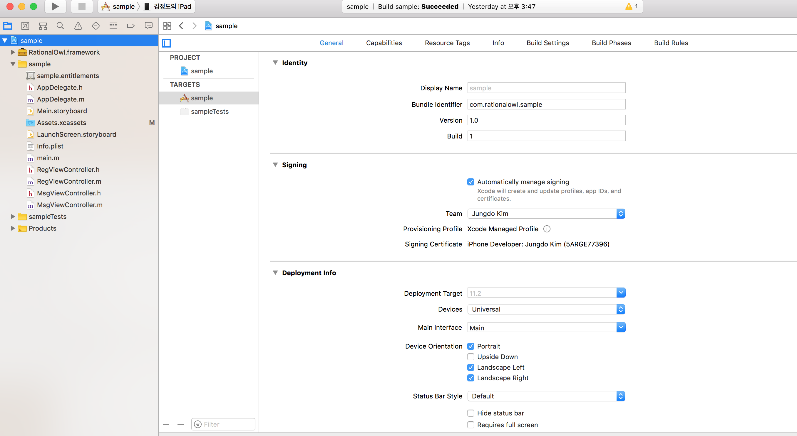

# General > Frameworks, Libraries, and Embedded Contents
1. 샘플앱 메인앱 확인
 - X Code Targets을 메인앱(sample)을 선택 후 'General > Frameworks, Libraries, and Embedded Contents' 확인
 - NotiServiceExtension.appex, RationalOwl.framework, UserNotification.framework 가 포함되어 있는지 확인

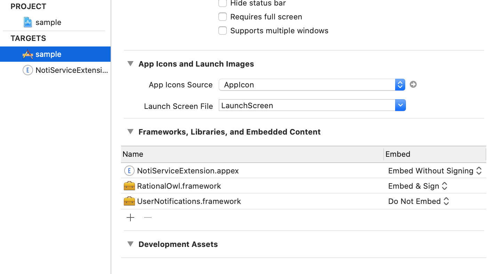

2. 리치 노티피케이션 지원을 위한 Service Extension 확인
 - X Code Targets을 NotiServiceExtension 선택 후 'General > Frameworks, Libraries, and Embedded Contents' 확인
 - 래셔널아울 라이브러리인 RationalOwl.framework 이 포함되어 있는지 확인

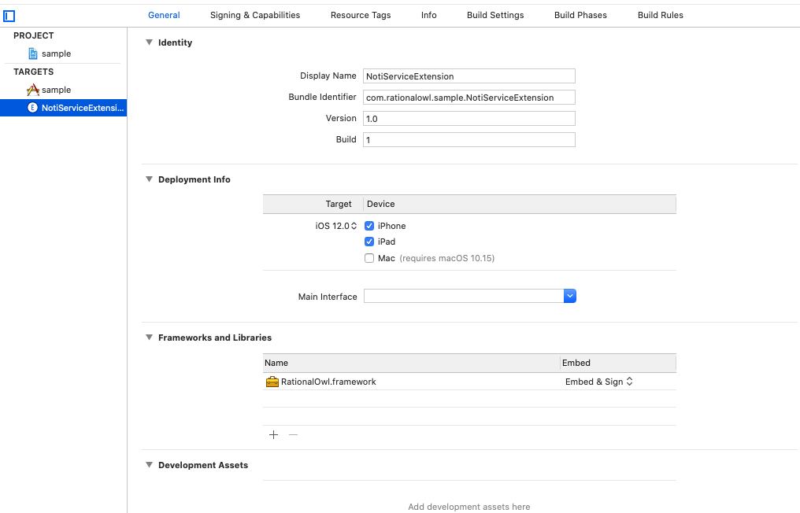

아래는 래셔널아울 라이브러리를 적용한 앱을 개발시 확인해야 하는 주요 설정이다. 실제 개발시 샘플앱을 기반으로 개발하면 기설정되어 있어 상관이 없지만 새로 만들거나 기존 자신의 앱을 기반으로 적용시 참조하기 바란다.

# Signing & Capabilities
1. 샘플앱 메인앱 확인
 - App Groups가 설정되어야 한다.
 - Push Notifications 설정이 되어야 한다.
 - Background Modes 의 Remote Notifications 항목이 체크되어야 한다.
 
 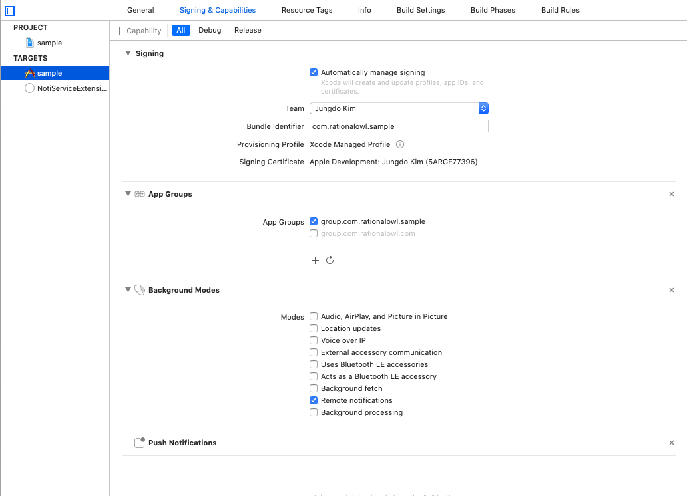

2. 리치 노티피케이션 지원을 위한 Service Extension 확인
 - X Code Targets을 NotiServiceExtension 선택 후 'Signing & Capabilities' 확인
 - App Groups 가 메인앱(sample)에서 설정된 것과 동일하게 설정되어 있는지 확인

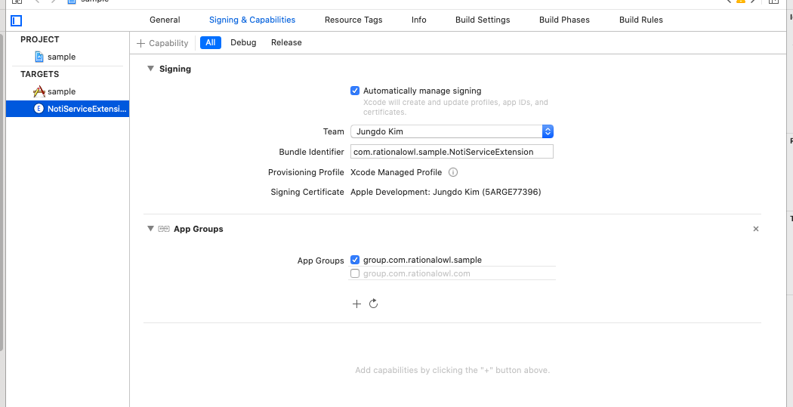

# Build Phases
1. 샘플앱 메인앱 확인
 - Link Binary With Libraries 에 UserNotifications.framework, RationalOwl.framework 가 설정
 - Embed Frameworks에 RationalOwl.framework 가 설정
 
 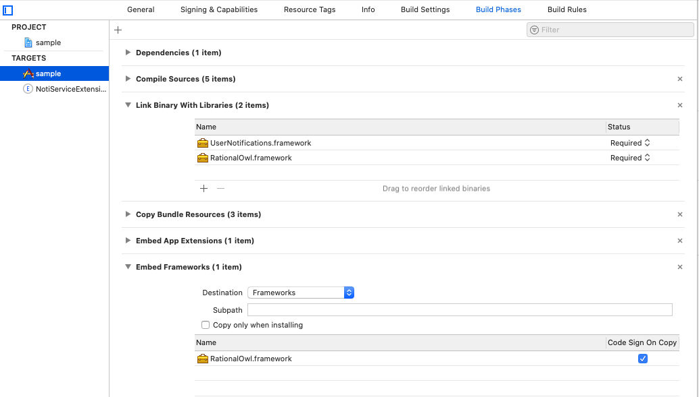

2. 리치 노티피케이션 지원을 위한 Service Extension 확인
 - Link Binary With Libraries 에 RationalOwl.framework 가 설정
 - Embed Frameworks에 RationalOwl.framework 가 설정
 
 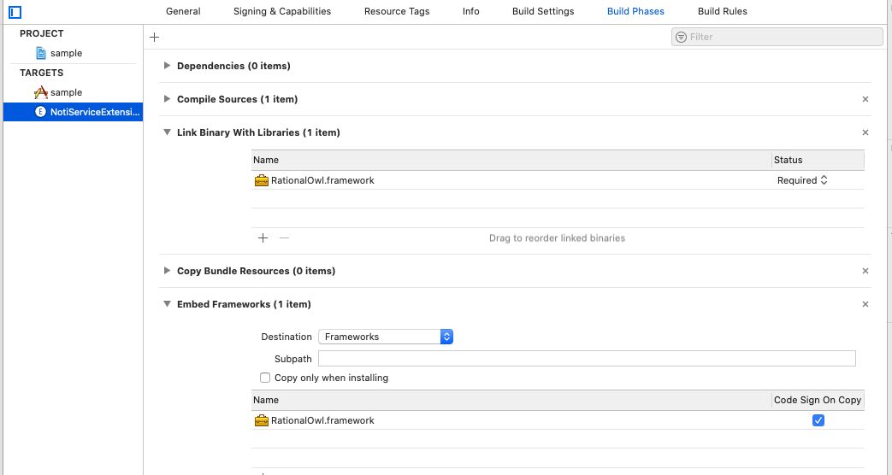

## 샘플 단말앱 실행

IOS 단말을 Mac에 연결 후 XCode 빌드를 통해 단말에 설치 및 실행한다. 

 - 샘플 단말앱이 APNS 알람을 이용해 시뮬레이션으로 실행할 수 없다.

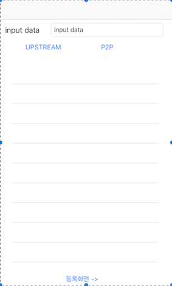

래셔널아울 관리자콘솔이 제공하는 실시간 모니터링은 서비스 개발 전 단계에서 실시간 데이터의 전달 현황뿐 아니라 개발 단계에서 앱서버와 단말앱의 각 기능 별 성공 여부를 확인할 수 있어 개발속도를 향상시키고 서비스 운영단계에서는 예측 가능성과 서비스 대응력을 높이는 역할을 한다. 샘플앱 개발시 관리자콘솔을 이용해 각 기능별 동작을 확인함으로써 그 편의성을 확인할 수 있을 것이다.

## 샘플 단말앱 UI 구성
샘플 단말앱의 화면 구성을 보려면 XCode에서 Main.storyboard를 클릭하면 확인할 수 있는데 2개의 화면으로 구성된다.

 - 메시지 화면
   - 다운스트림 메시지 수신시 화면에 표시
   - P2P 메시지 수신시 화면에 표시
   - 업스트림 메시지 발신 기능 제공
   - P2P 메시지 발신 기능 제공
 - 단말앱 등록/등록 해제 화면
   - 단말앱 등록 기능 제공
   - 단말앱 등록해제 기능 제공
   - 수/발신 메시지는 TableView에 디스플레이

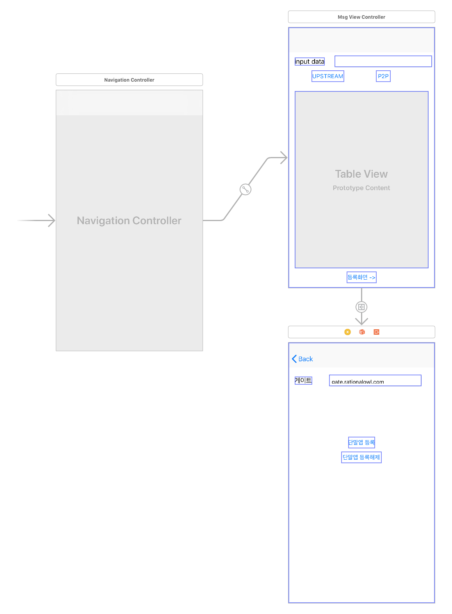

 
## 샘플 단말앱 소스 구성
샘플 단말앱의 소스는 세개로 구성된다. 각 소스에서는 래셔널아울 단말앱 개발시 필요한 코드와  래셔널아울 단말앱 API이용법을 제공한다. 

 - AppDelegate
   - 단말앱 구동시 APNS 등록
   - 단말앱 백그라운드 전환시 enterBackground API 호출
   - 단말앱 포그라운드 전환시 becomeActive API 호출
   - APNS콜백에서 호출해야하는 래셔널아울 단말API 

 - RegViewController
   - 단말앱 등록 API 호출
   - 단말앱 등록해제 API 호출
   - 단말앱 등록/등록해제 결과 콜백

- MsgViewController
   - 업스트림 메시지 발신 API 호출
   - 업스트림 메시지 발신 결과 콜백
   - P2P 메시지 발신 API 호출
   - P2P 메시지 발신 결과 콜백
   - 다운스트림 메시지 수신시 콜백
   - P2P 메시지 수신시 콜백

>## 단말앱 등록

샘플 단말앱에서 단말앱을 등록하기 위해서는 다음 절차를 따르면 된다.

1. 샘플앱 초기 메시지 화면에서 '등록화면->'버튼을 클릭 => 등록화면으로 전이
2. 등록화면에서 '단말앱 등록'버튼 클릭

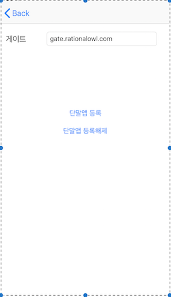

샘플코드에서 registerDevice API를 검색하면 관련 샘플코드를 확인할 수 있다. 

## 단말앱 등록해제

샘플 단말앱에서 단말앱 등록하기 위해서는 다음 절차를 따르면 된다.

1. 등록화면에서 '단말앱 등록해제'버튼 클릭

샘플코드에서 unregisterDevice API를 검색하면 관련 샘플코드를 확인할 수 있다. 

## 업스트림 메시지 발신

샘플 단말앱에서 업스트림 메시지를 발신하기 위해서는 다음 절차를 따르면 된다.

1. 샘플앱 메시지 화면에서 'input data'에 발신할 메시지 입력
2. 'UPSTREAM'버튼 클릭
3. 샘플앱에 '=>' 문자가 발신 데이터 앞에 붙어서 업스트림 발신임을 나타낸다.

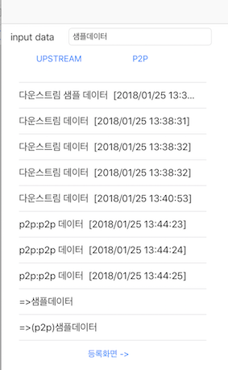

래셔널아울 관리자 콘솔의 '서비스 > 메시지 현황'을 통해 샘플앱을 통한 메시지 전달을 실시간 모니터링할 수 있고 개발 속도를 향상시킬 수 있다.

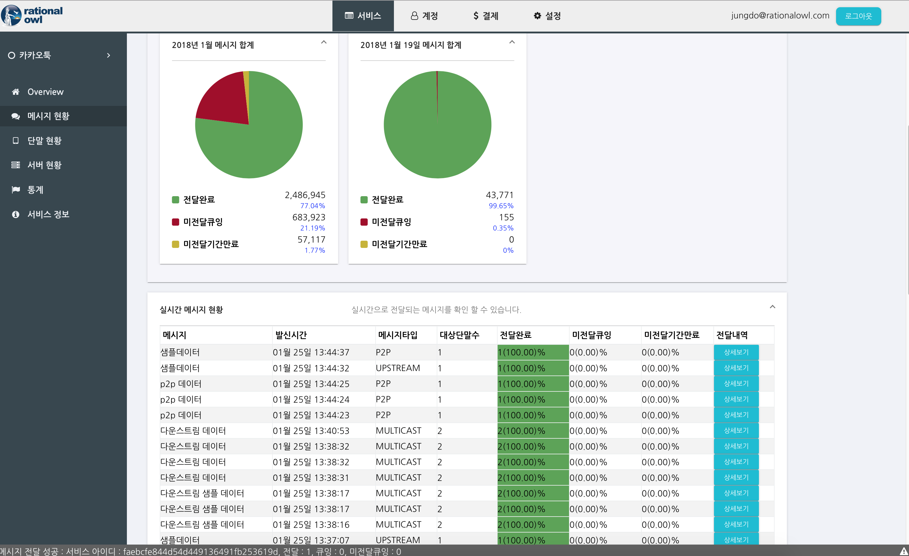

샘플코드에서 sendUpstreamMsg API를 검색하면 관련 샘플코드를 확인할 수 있다. 

## P2P 메시지 발신

샘플 단말앱에서 P2P 메시지를 발신하기 위해서는 다음 절차를 따르면 된다.

1. 샘플앱 메시지 화면에서 'input data'에 발신할 메시지 입력
2. 'P2P'버튼 클릭
3. 샘플앱에 '=>(p2p)' 문자가 발신 데이터 앞에 붙어서 P2P 발신임을 나타낸다.

샘플코드에서 sendP2PMsg API를 검색하면 관련 샘플코드를 확인할 수 있다. 

## 메시지 수신
단말앱은 앱서버로부터의 다운스트림 메시지와 다른 단말앱으로부터의 P2P 메시지를 수신한다. 

### 다운스트림 메시지 수신

샘플 단말앱에서 앱서버로부터의 다운스트림 메시지 수신시 다음과 같이 동작한다.

1. 샘플앱에 수신데이터와 메시지 발신시간이 디스플레이된다.

단말앱이 다운스트림 메시지를 수신시 onDownstreamMsgRecieved 콜백이 호출된다. 샘플 코드에서 onDownstreamMsgRecieved API를 검색하면 관련 샘플코드를 확인할 수 있다.

### P2P 메시지 수신

샘플 단말앱에서 다른 단말앱으로부터의 P2P 메시지 수신시 다음과 같이 동작한다.

1. 샘플앱에 수신데이터 앞에 'p2p'문자가 붙고 발신시간이 디스플레이된다.

단말앱이 P2P 메시지를 수신시 onP2PMsgRecieved 콜백이 호출된다. 샘플 코드에서 onP2PMsgRecieved API를 검색하면 관련 샘플코드를 확인할 수 있다.

