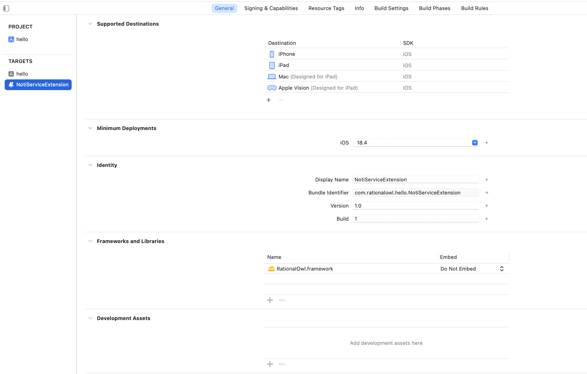
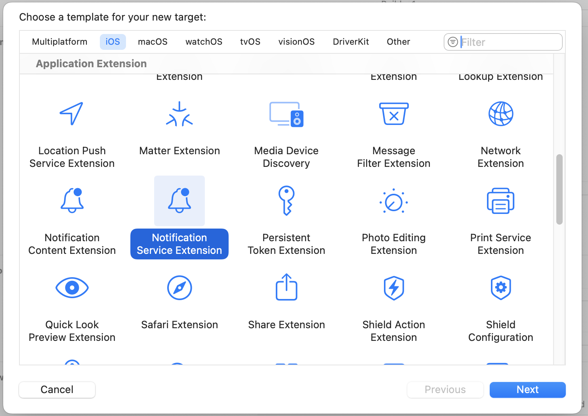
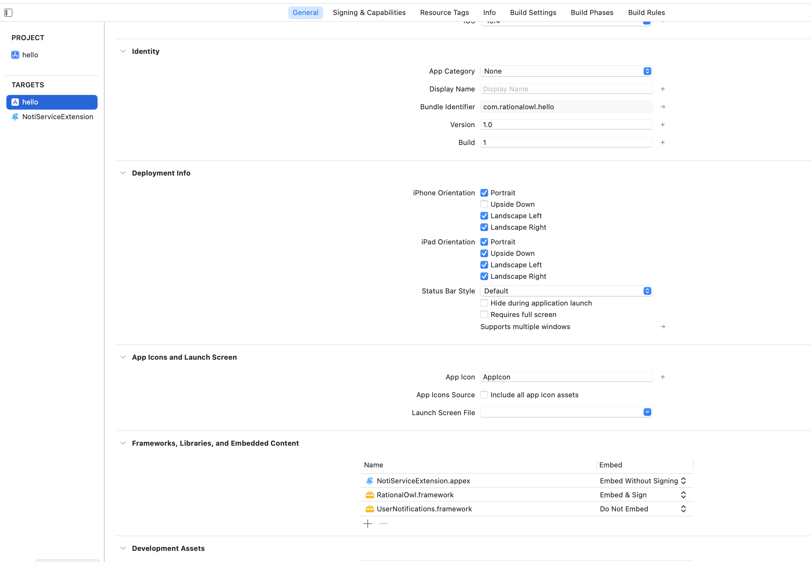
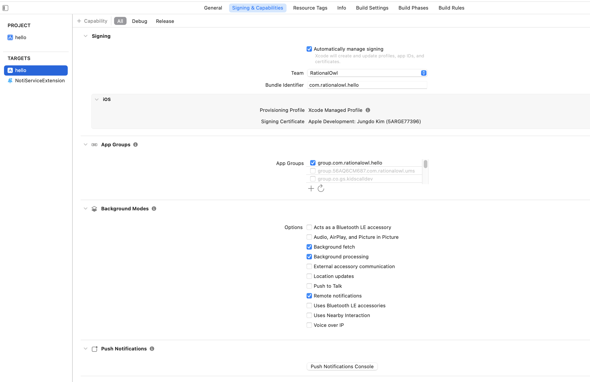
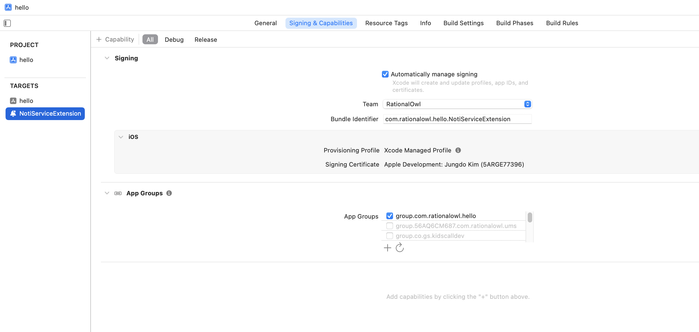
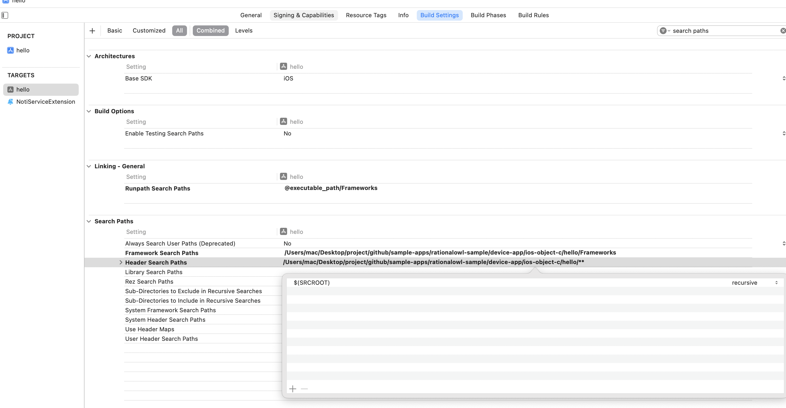
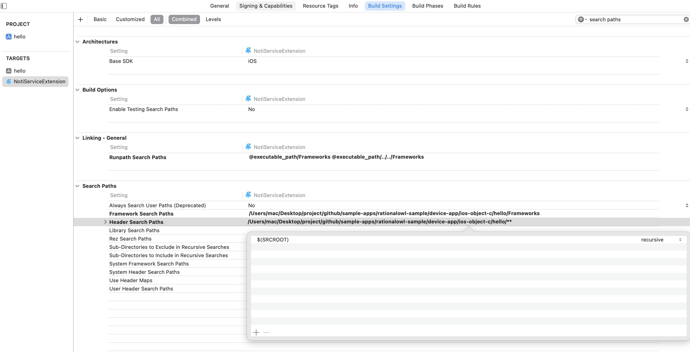

# 래셔널아울 IOS Swift 단말앱 샘플
IOS Swift 단말앱 샘플은 IOS Objective-C 단말앱 라이브러리에서 제공하는 API를 이용해서 단말앱을 만드는 것을 쉽게 따라할 수 있도록 작성되었다. 

- 샘플 코드내 RationalOwl.framework 라이브러리내 헤더 파일에 API 정의를 참조하여 샘플코드에 사용된 API 파라미터를 자신의 샘플앱에 맞게 수정한다.
- 필요한 기반 지식은 [IOS 단말앱 개발 가이드](http://guide.rationalowl.com/guide/device-app)을 참조한다.
- 본 샘플앱은 래셔널아울 커스텀 푸시를 지원한다. 커스텀 푸시의 개념은 [커스텀푸시 앱 개발](https://rationalowl.tistory.com/21) 을 참조한다.
- 샘플앱에서 제공되는 래셔널아울 라이브러리인 RationalOwl.framework/RationalOwl 은 유니버설 프레임워크로 시뮬레이션을 위한 x86_64, 실제 폰을 위한 Arm64를 모두 지원한다. 실제 앱스토어에 배포시에는 lipo -remove x86_64 명령어로 시뮬레이션용 아키텍쳐를 제거후 앱스토어에 배포해야 한다.

## 개발 전 IOS 설정
[IOS 설정 가이드](https://github.com/RationalOwl/rationalowl-guide/tree/master/device-app/ios-apns-p8)를 통해 개발 전 아래 설정을 먼저 진행해야 한다.

- APNS 발신용 인증서 생성 및 래셔널아울 서비스에 등록

## 샘플 프로젝트 설정
1. github에서 샘플코드를 다운받는다.
2. 다운받은 폴더에서 'sample.xcodeproj'파일을 클릭하여 XCode를 실행한다.
 - 샘플앱을 XCode로 실행하면 실행가능한 상태로 설정들이 되어 있다.
 - 프로젝트 루트에 'RationalOwl.framework'파일이 래셔널아울 IOS 단말앱 라이브러리이다.
    
## 리치 노티피케이션
 - IOS에서 이미지 푸시 및 커스텀 푸시를 지원하는 개념을 리치 노티피케이션(Rich Notification)이라고 명한다.
 - 래셔널아울 푸시도 커스텀 푸시를 지원하고 IOS에서 리치 노티피케이션을 이용한다.
 - 깃헙에서 다운로드한 샘플앱은 해당 설정이 모두 세팅된 상태이다.
 - 샘플앱을 xcode로 실행하여 targets을 보면 NotiServiceExtension이 메인앱(hello) 밑에 표시되는 것을 확인 할 수 있을 것이다.
 

### 리치 노티피케이션 생성
 
 - 별도 프로젝트를 통해 리치 노티피케이션을 새로 만들려면 xcode 에서 'File > New > Target...' 을 클릭하여 Notification Service Extension을 선택하여 생성하면 된다.
 

# General 탭 확인
1. 샘플앱 메인앱 확인
 - Targets을 메인앱(hello)을 선택
 - Frameworks, Libraries, and Embedded Contents 에 RationalOwl.framework, UserNotification.framework 가 포함되어 있는지 확인

2. Notification Service Extension 탭 확인
 - Targets을 NotiServiceExtension 선택
 - RationalOwl.framework 이 포함되어 있는지 확인

# Signing & Capabilities  탭 확인
1. 샘플앱 메인앱 확인
 - Targets을 메인앱(hello)을 선택
 - App Groups가 설정되어 있는지 확인
    - hello 앱 기준: group.com.rationalowl.com
 - Push Notifications 설정이 되어야 한다.
 - Background Modes 의 Remote Notifications 항목이 체크되어야 한다.
 
 

2. Notification Service Extension 탭 확인
 - Targets을 NotiServiceExtension 선택
 - App Groups 이 메인앱(sample)에서 설정된 것과 동일하게 설정되어 있는지 확인

# Build Settings 탭 확인
1. 샘플앱 메인앱 확인
 - Framework Search Paths, Header Search Paths 항목에 $(SRCROOT) recursive로 설정
 
 

2. Notification Service Extension 탭 확인
 - Targets을 NotiServiceExtension 선택
 - Framework Search Paths, Header Search Paths 항목에 $(SRCROOT) recursive로 설정
 

 
## 샘플 단말앱 소스 구성
샘플 단말앱의 소스는 세개로 구성된다. 각 소스에서는 래셔널아울 단말앱 개발시 필요한 코드와  래셔널아울 단말앱 API이용법을 제공한다. 

 - AppDelegate
   - 단말앱 구동시 APNS 등록
   - 단말앱 백그라운드 전환시 enterBackground API 호출
   - 단말앱 포그라운드 전환시 becomeActive API 호출
   - APNS콜백에서 호출해야하는 래셔널아울 단말API 

 - RegViewController
   - 단말앱 등록 API 호출
   - 단말앱 등록해제 API 호출
   - 단말앱 등록/등록해제 결과 콜백

- MsgViewController
   - 푸시 메시지 수신시 콜백

>## 단말앱 등록

- 샘플코드에서 registerDevice 를 검색하면 관련 샘플코드를 확인할 수 있다. 
- MinervaManager.registerDevice API는 단말앱 등록 API로 해당 API가 호출해야 앱에서 래셔널아울 푸시알림 수신 및 실시간 데이터 수/발신 API를 이용할 있다.
- registerDevice API 실행결과는 onRegisterResult() 콜백함수를 통해 알수 있다. 

## 단말앱 등록해제

- 샘플코드에서 unregisterDevice 를 검색하면 관련 샘플코드를 확인할 수 있다. 
- MinervaManager.unregisterDevice API는 단말앱 등록해제 API이다.
- unregisterDevice API 실행결과는 onUnregisterResult() 콜백함수를 통해 알수 있다.

## 단말앱 등록 및 등록해제 콜백 지정
- 샘플코드에서 setDeviceRegisterResultDelegate 를 검색하면 관련 샘플코드를 확인할 수 있다. 
- setDeviceRegisterResultDelegate API를 통해 단말앱 등록 및 등록해제 결과를 처리하는 콜백을 지정한다.

## 푸시메시지 수신 콜백 처리
- IOS Rich Notification을 통해 푸시 메시지를 수신한다.
- 샘플 코드의 UNNotificationServiceExtension 를 검색하여 소스수준에서 참조한다.
- IOS Rich Notification의 이론은 표준 IOS 개념이어서 온라인 상에서 쉽게 참조할 수 있다.

## 래셔널아울 메시지 콜백 지정

- 샘플코드에서 setDeviceRegisterResultDelegate 를 검색하면 관련 샘플코드를 확인할 수 있다. 
- 미전달 푸시 알림 처리 콜백과 실시간 데이터 처리 콜백을 지정한다.
  - onPushMsgRecieved: 앱 실행시 미전달 푸시알림을 알려주는 콜백으로 미전달 푸시알림을 처리하는 루틴 제공  
  - 실시간 데이터 처리 관련 콜백
    - onDownstreamMsgRecieved, onP2PMsgRecieved, onUpstreamMsgResult, onP2PMsgResult
    - 본 샘플은 푸시알림 이용만 보여주고 실시간 데이터는 이용하지 않음.
  - 앱 미실행시 푸시 알림 콜백처리는 앞서 언급한 '푸시메시지 수신 콜백 처리' 부분을 참고.

## API 레퍼런스

솔루션 연동 관련 API는 'RationalOwl.framework' 파일 내 MinervaManager.h, MinervaDelegate.h 파일을 참조한다.

## 속성 연동

속성으로 래셔널아울 솔루션 연동을 쉽고 빠르게 적용하기 위한 팁을 제공한다. 

1.  API 호출부 검색

래셔널아울 API 호출은 MinervaManager 클래스에서 호출한다. 따라서 샘플앱을 다운로드 후 개발 Editor에서 MinervaManager.getInstance()을 검색하면 래셔널아울 API호출한 부분을 모두 검색할 수 있다. 안드로이드, IOS 모두 API 호출이 비슷하지만 OS 특성상 상이한 부분도 있으므로 각 OS 환경에서 주의가 필요하다.
다음은 IOS 환경에서 MinervaManager.getInstance() 검색결과이다. 아래의 API가 제대로 적용되어 호출되고 있는 지 확인한다.
- setAppGroup(), setDeviceToken(), enableNotificationTracking(), receivedApns(), becomeActive()
- enterBackground(), setDeviceRegisterResultDelegate(), setMessageDelegate(), registerDevice(), unregisterDevice()

2.  앱그룹 확인

Signing & Capabilities  탭에서 설정한 앱그룹명(샘플앱 기준 group.com.rationalowl.hello) 으로 xcode 전체 검색시 4 군데에서 검색되어야 한다.
- Signing & Capabilities  탭 메인앱 Target 설정 1개, 서비스 익스텐션 Target에서 설정시 1개 총 2개 검색됨.
  - appgroup 설정시 entitlements 파일에 저장되어 entitlements 파일이 검색됨.
- setAppGroup API, enableNotificationTracking API 파라미터에 앱 그룹명 포함되어 2개 검색됨.

3.  콜백함수 확인

래셔널아울 콜백함수는 DeviceRegisterResultListener(), MessageListener() 2개의 인터페이스에서 정의한다.

- DeviceRegisterResultListener에서 정의된 콜백들이 정상적으로 호출되는지 확인
    - onRegisterResult: 단말앱 등록 결과 콜백
    - onUnregisterResult: 단말앱 등록해제 결과 콜백
- MessageListener에서 정의된 콜백들이 정상적으로 호출되고 구현했는지 확인
    - onPushMsgRecieved: 1. 앱실행 중 푸시알림 수신시 콜백 호출, 2. 앱실행시 미전달 푸시알림 목록 전달 콜백 호출
    - onP2PMsgRecieved, onDownstreamMsgRecieved, onSendUpstreamMsgResult, onSendP2PMsgResult: 래셔널아울 실시간 데이터 이용시 